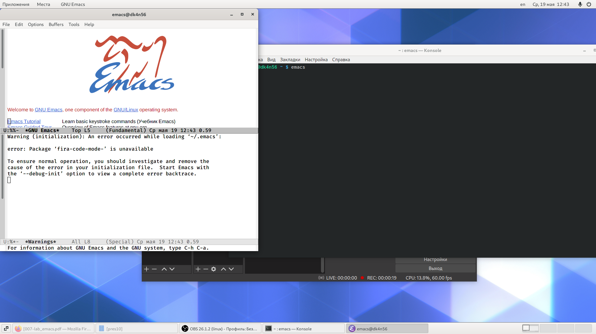
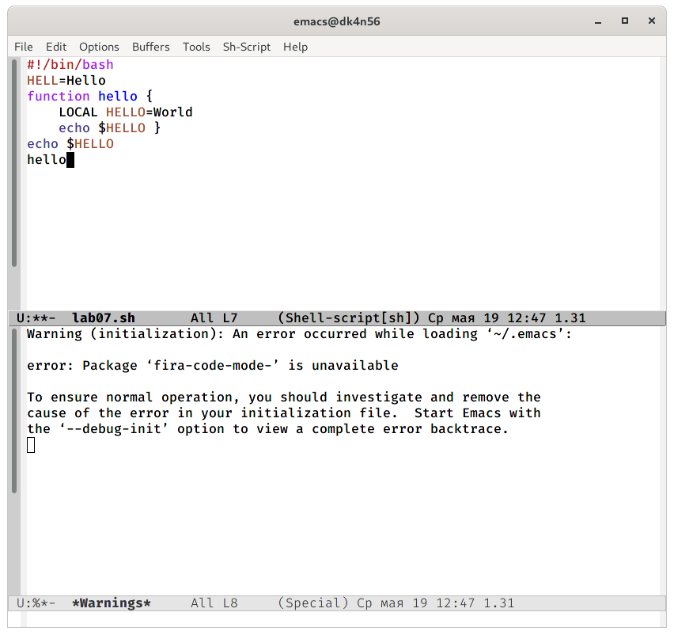
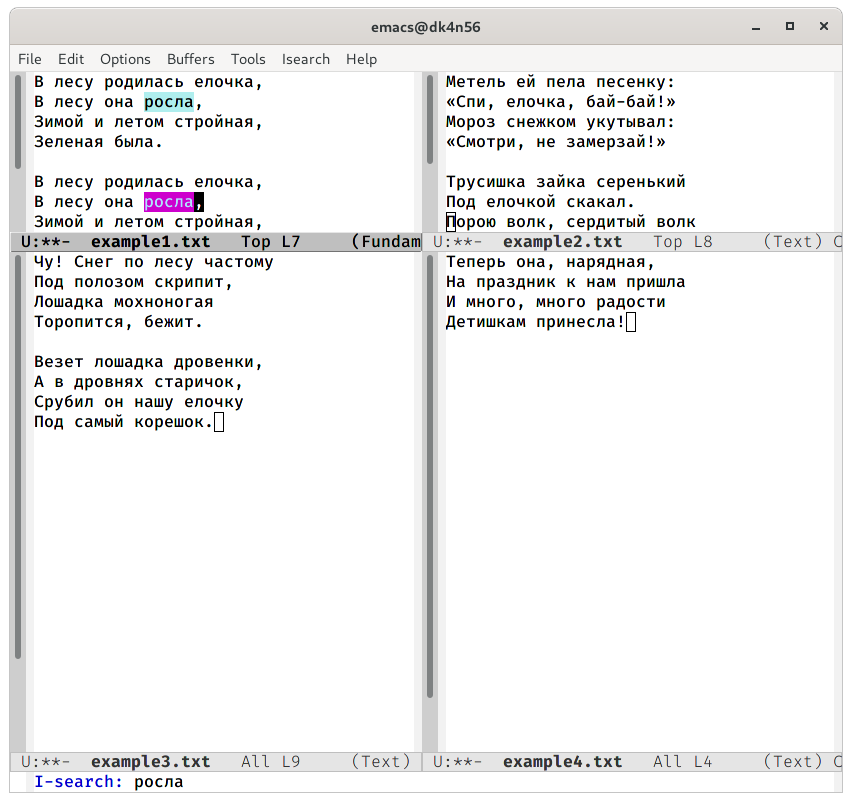
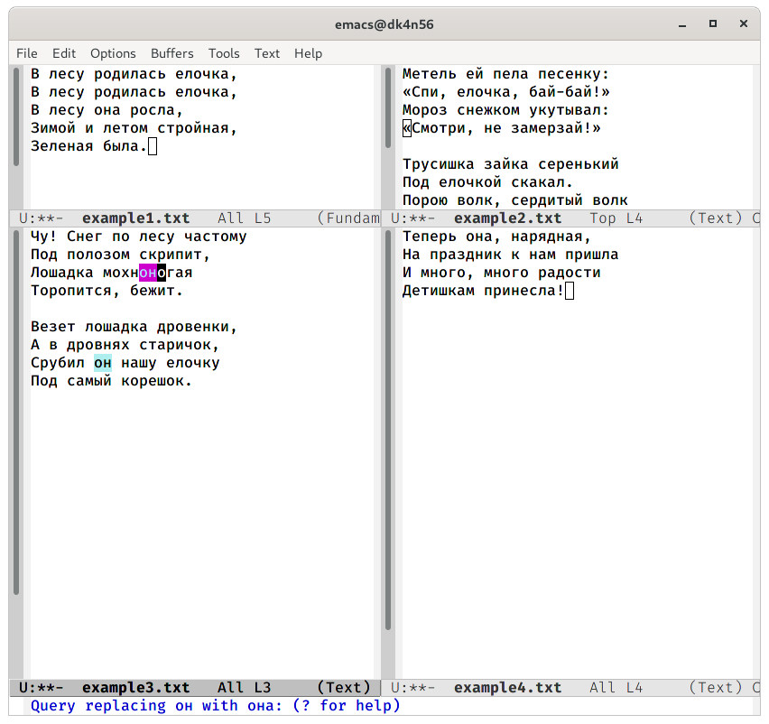

---
## Front matter
lang: ru-RU
title: Операционные системы 
author: Колчева Юлия Вячеславовна
institute: RUDN University, Moscow, Russian Federation

date: 19 мая 2021 год

## Formatting
toc: false
slide_level: 2
theme: metropolis
header-includes: 
 - \metroset{progressbar=frametitle,sectionpage=progressbar,numbering=fraction}
 - '\makeatletter'
 - '\beamer@ignorenonframefalse'
 - '\makeatother'
aspectratio: 43
section-titles: true
---

# Лабораторная работа №10

## Редактор Emacs
Редактор Emacs

{ #fig:001 width=70% }

## Работа с текстом

В открывшемся буфере наберем необходимый текст

{ #fig:003 width=70% }

## Режим поиска

Переключимся в режим поиска («Ctrl-s») и найдем несколько слов, присутствующих в тексте 

{ #fig:020 width=70% }

## Поиск и замена

Перейдем в  режим  поиска  и  замены  («Alt-%»),  введем текст, нажмем «enter» и введем текст для замены. После нажмем «!» для подтверждения замены.

{ #fig:022 width=70% }

## Выводы

В ходе выполнения данной лабораторной работы я познакомилась с операционной системой Linux и получила практические навыки работы с редактором Emacs.

## {.standout}

Спасибо за внимание!
