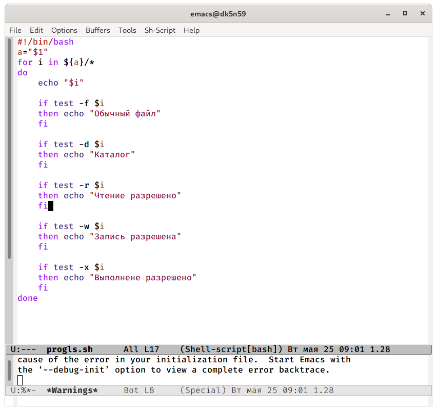
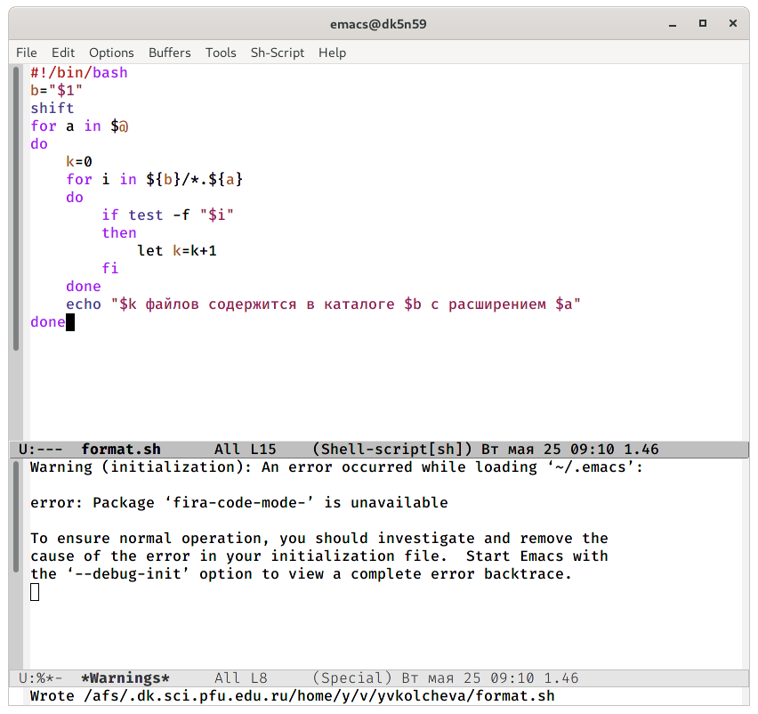

---
## Front matter
lang: ru-RU
title: Операционные системы 
author: Колчева Юлия Вячеславовна
institute: RUDN University, Moscow, Russian Federation

date: 25 мая 2021 год

## Formatting
toc: false
slide_level: 2
theme: metropolis
header-includes: 
 - \metroset{progressbar=frametitle,sectionpage=progressbar,numbering=fraction}
 - '\makeatletter'
 - '\beamer@ignorenonframefalse'
 - '\makeatother'
aspectratio: 43
section-titles: true
---

# Лабораторная работа №11

## Скрипты

Командный  файл−аналог  команды ls.  (рис. -@fig:008)

{ #fig:008 width=70% }

## Скрипты

Написала командный файл, который получает в качестве аргумента командной строки формат файла и вычисляет количество таких файлов в указанной директории.(рис. -@fig:010)

{ #fig:010 width=70% }

## Выводы

В ходе выполнения данной лабораторной работы я изучила основы программирования  в  оболочке  ОС UNIX/Linux и  научилась писать небольшие командные файлы.

## {.standout}

Спасибо за внимание!
