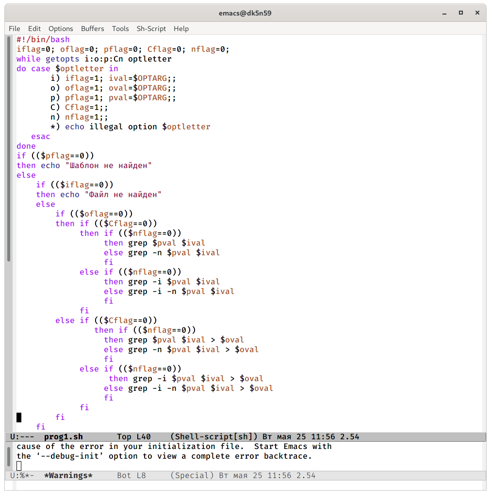
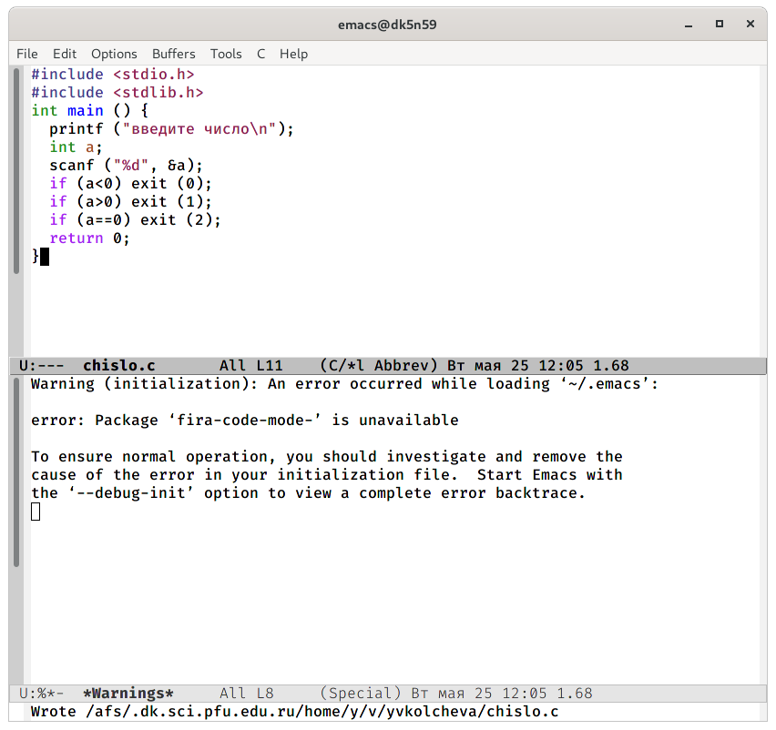
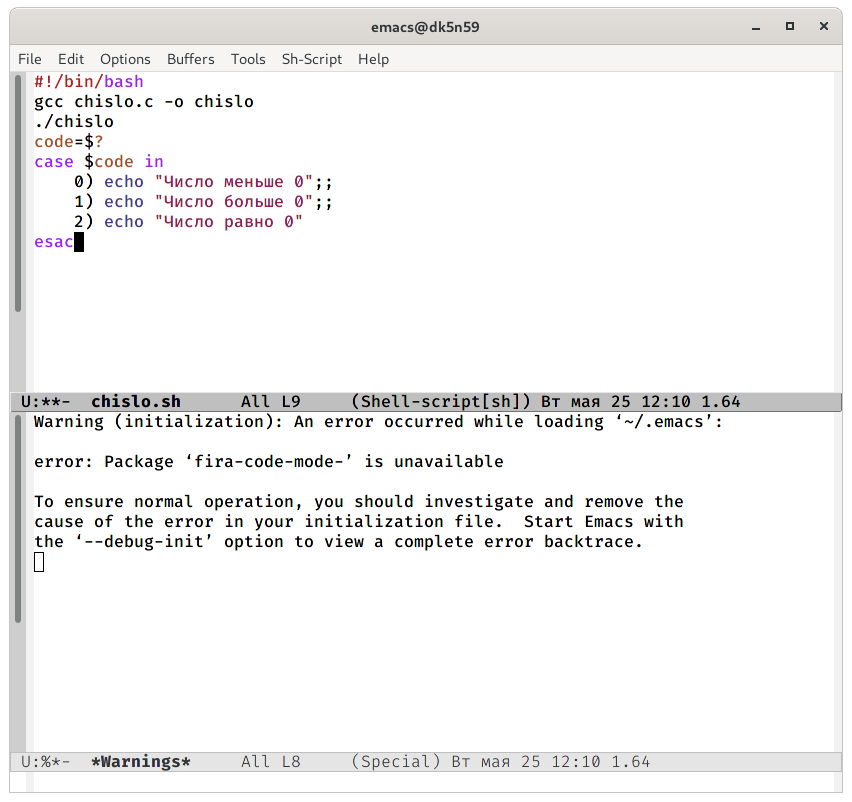

---
## Front matter
lang: ru-RU
title: Операционные системы 
author: Колчева Юлия Вячеславовна
institute: RUDN University, Moscow, Russian Federation

date: 25 мая 2021 год

## Formatting
toc: false
slide_level: 2
theme: metropolis
header-includes: 
 - \metroset{progressbar=frametitle,sectionpage=progressbar,numbering=fraction}
 - '\makeatletter'
 - '\beamer@ignorenonframefalse'
 - '\makeatother'
aspectratio: 43
section-titles: true
---

# Лабораторная работа №12

## анализ ключей

Используя команды getopts grep, написала командный файл, который анализирует командную строку с ключами:

{ #fig:001 width=70% }

## Программа на си

Написала на языке Си программу, которая вводит число и определяет, является  ли  оно  больше  нуля,  меньше  нуля  или  равно  нулю.

{ #fig:003 width=70% }

## Режим поиска

{ #fig:004 width=70% }

## Выводы

В ходе выполнения  данной  лабораторной  работы  я  изучила основы программирования в оболочке ОС UNIX и научилась писать более сложные командные файлы с использованием логических управляющих конструкций и циклов.

## {.standout}

Спасибо за внимание!
