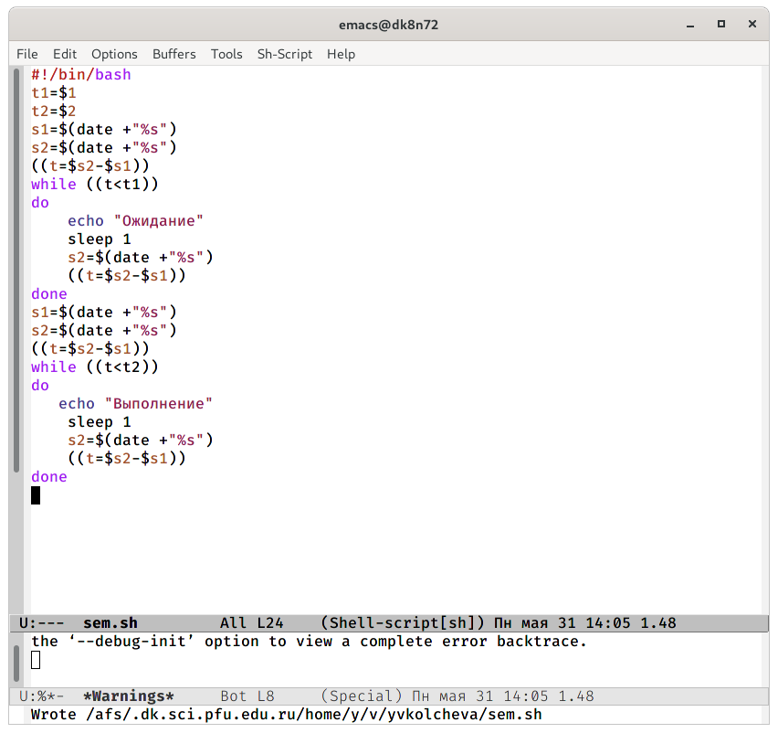
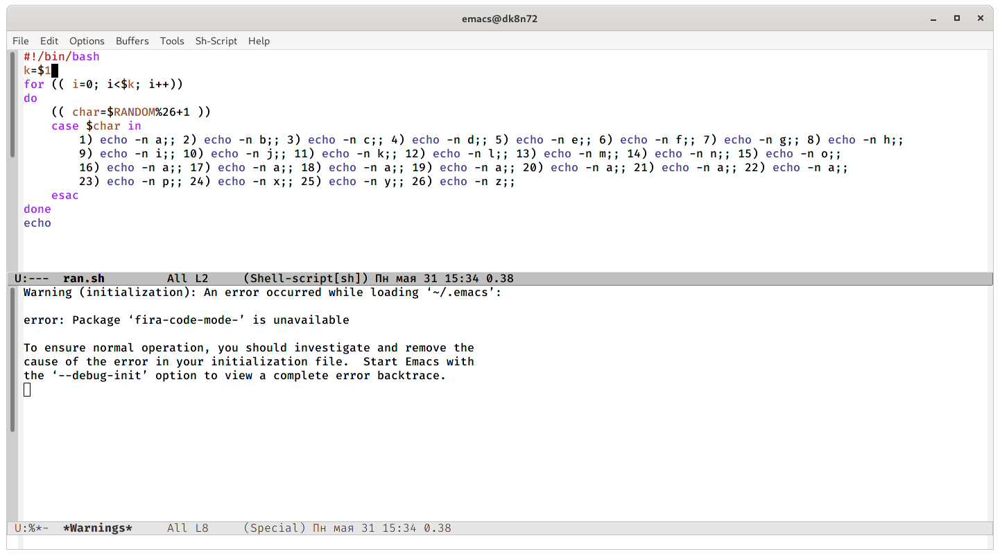

---
## Front matter
lang: ru-RU
title: Операционные системы 
author: Колчева Юлия Вячеславовна
institute: RUDN University, Moscow, Russian Federation

date: 31 мая 2021 год

## Formatting
toc: false
slide_level: 2
theme: metropolis
header-includes: 
 - \metroset{progressbar=frametitle,sectionpage=progressbar,numbering=fraction}
 - '\makeatletter'
 - '\beamer@ignorenonframefalse'
 - '\makeatother'
aspectratio: 43
section-titles: true
---

# Лабораторная работа №13

## Скрипты

Сначала я написала командный  файл,  реализующий  упрощённый  механизм семафоров.

{ #fig:001 width=70% }

## Скрипты

3) Используя встроенную переменную $RANDOM, написала командный  файл, генерирующий  случайную  последовательность букв латинского алфавита. 

{ #fig:010 width=70% }

## Выводы

Я зучила основы программирования в оболочке ОС UNIХ и научилась писать более сложные командные  файлы  с  использованием логических управляющих конструкций и циклов.

## {.standout}

Спасибо за внимание!
