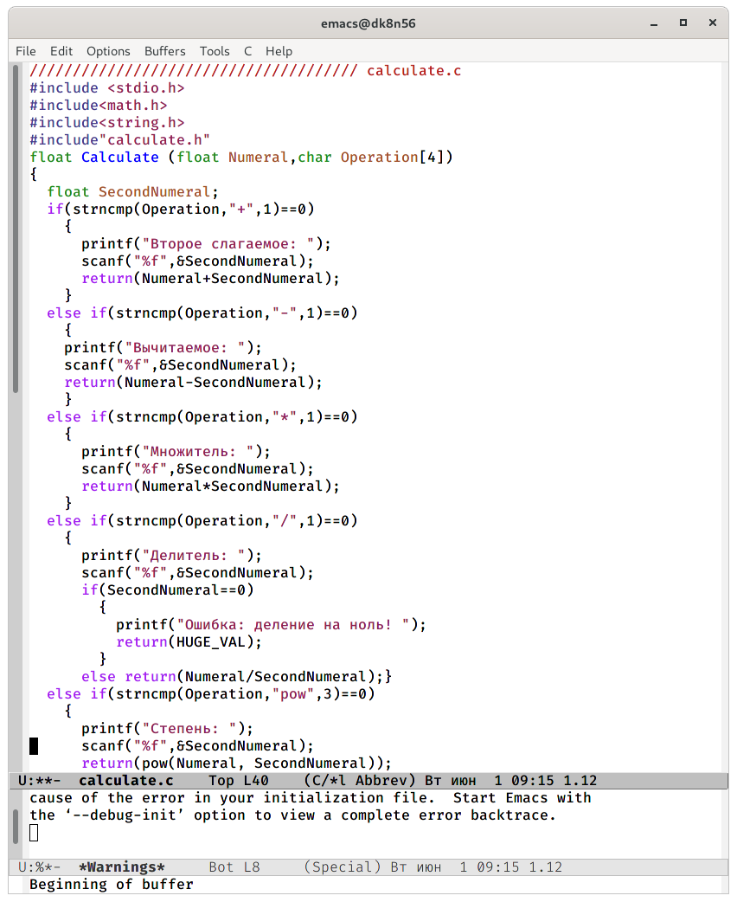
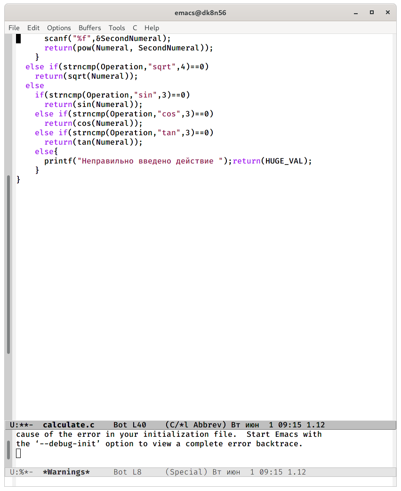
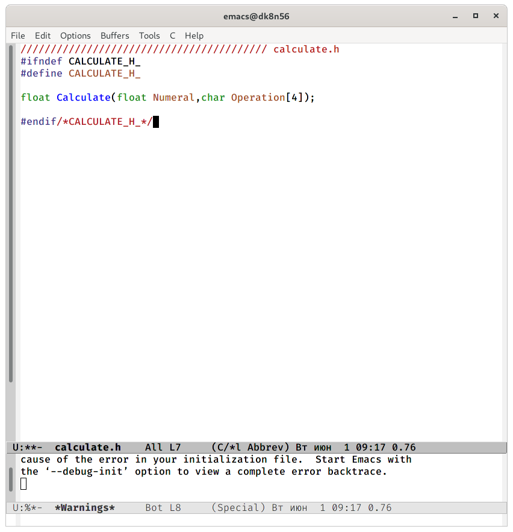
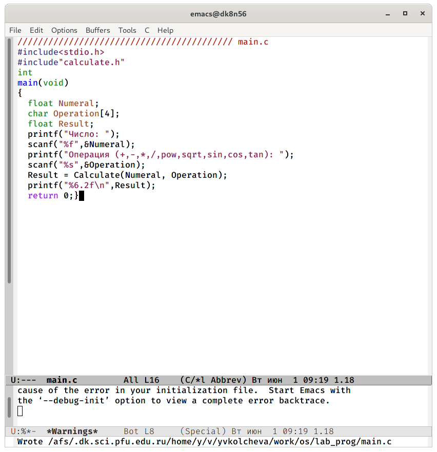
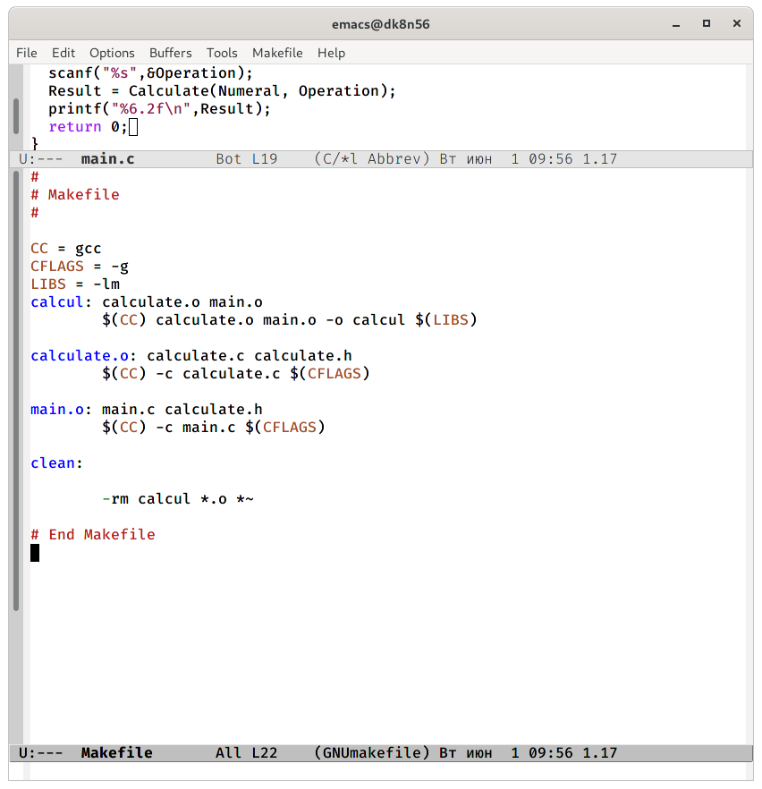
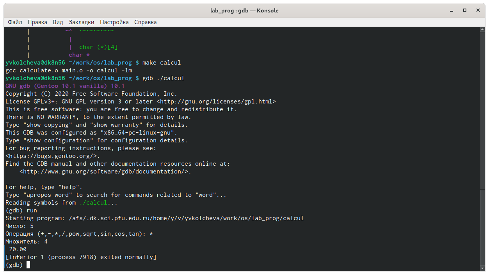

---
## Front matter
lang: ru-RU
title: Операционные системы 
author: Колчева Юлия Вячеславовна
institute: RUDN University, Moscow, Russian Federation

date: 1 июня 2021 год

## Formatting
toc: false
slide_level: 2
theme: metropolis
header-includes: 
 - \metroset{progressbar=frametitle,sectionpage=progressbar,numbering=fraction}
 - '\makeatletter'
 - '\beamer@ignorenonframefalse'
 - '\makeatother'
aspectratio: 43
section-titles: true
---

# Лабораторная работа №14

## Калькулятор

Реализация функций калькулятора в файле calculate.с

{ #fig:002 width=40% } 

{ #fig:003 width=40% }

## Калькулятор

Интерфейсный файл calculate.h, описывающий формат вызова функции калькулятора

{ #fig:004 width=70% }

## Калькулятор

 Основной файл main.c,реализующий интерфейс пользователя калькулятору

{ #fig:005 width=70% }

## Калькулятор

Makefile

{ #fig:008 width=70% }

## Калькулятор

Для запуска программы внутри отладчика ввела команду «run».

{ #fig:011 width=70% }

## Выводы

В ходе выполнения данной лабораторной работы я приобрелапростейшие навыки разработки, анализа, тестирования и отладки приложений в ОС типа UNIX/Linuxна примере создания на языке программирования С калькулятора с простейшими функциями.

## {.standout}

Спасибо за внимание!
