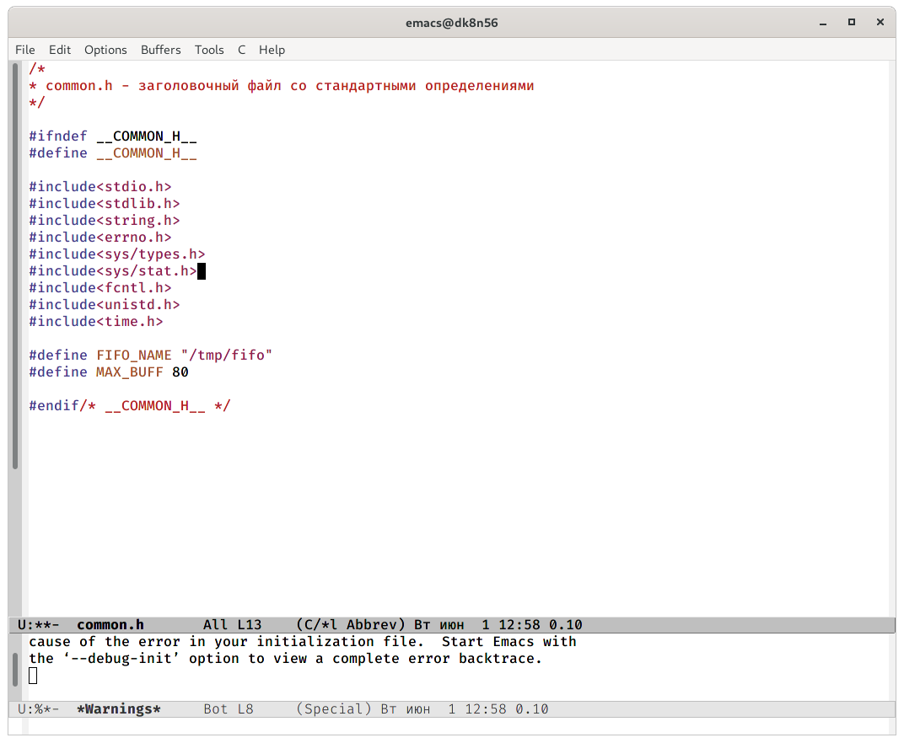
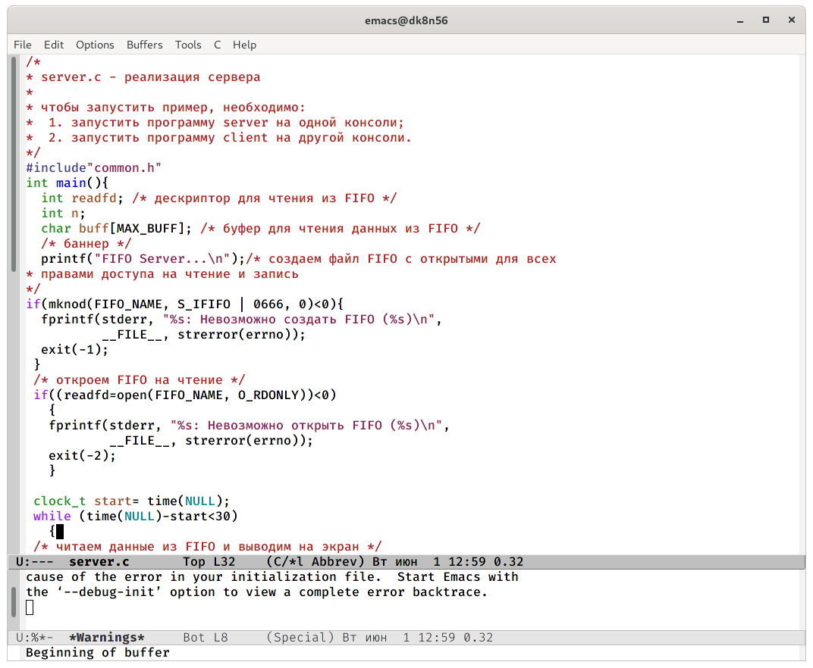
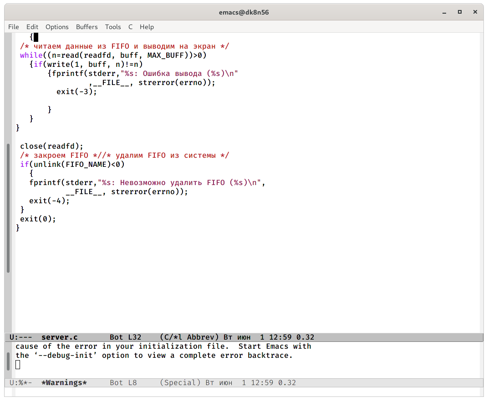
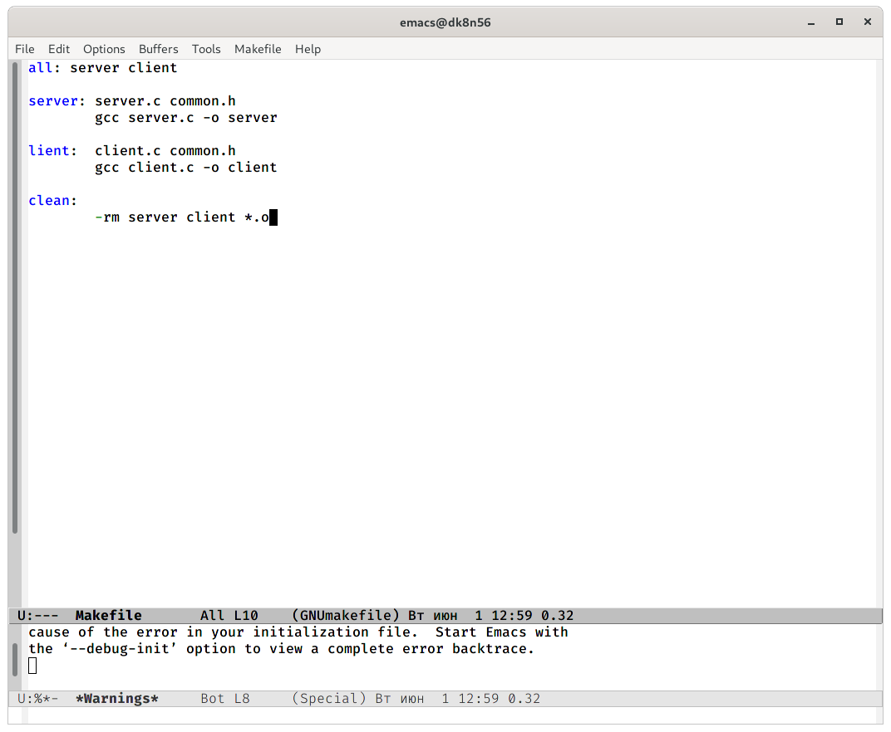
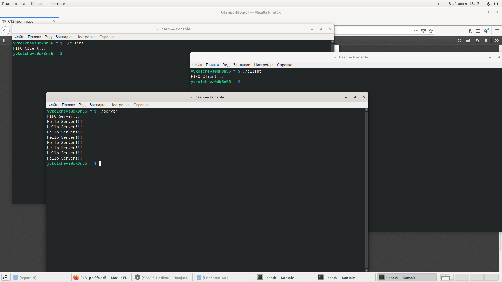

---
## Front matter
lang: ru-RU
title: Операционные системы 
author: Колчева Юлия Вячеславовна
institute: RUDN University, Moscow, Russian Federation

date: 1 июня 2021 год

## Formatting
toc: false
slide_level: 2
theme: metropolis
header-includes: 
 - \metroset{progressbar=frametitle,sectionpage=progressbar,numbering=fraction}
 - '\makeatletter'
 - '\beamer@ignorenonframefalse'
 - '\makeatother'
aspectratio: 43
section-titles: true
---

# Лабораторная работа №15

## Первая программа

Common.h предназначен для заголовочных файлов

{ #fig:001 width=70% }

## Вторая программа

файл server.c добавила цикл while для контроля за временем работы сервера

{ #fig:002 width=30% } 

{ #fig:003 width=30% } 

## Makefile

Makefile

{ #fig:006 width=70% }

## Работа программы

{ #fig:008 width=70% }

## Выводы

Приобретение практических навыков работы с именованными каналами.

## {.standout}

Спасибо за внимание!
