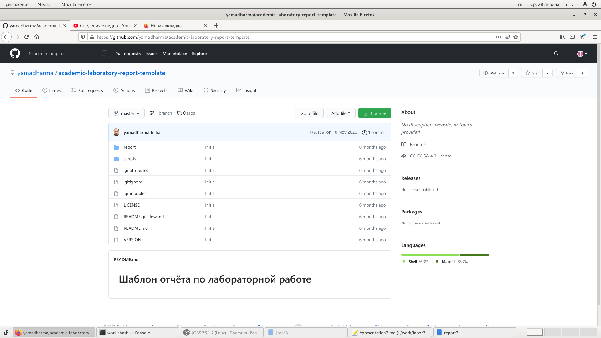
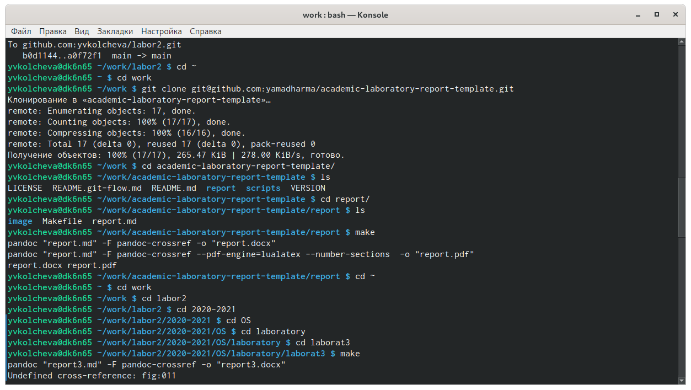
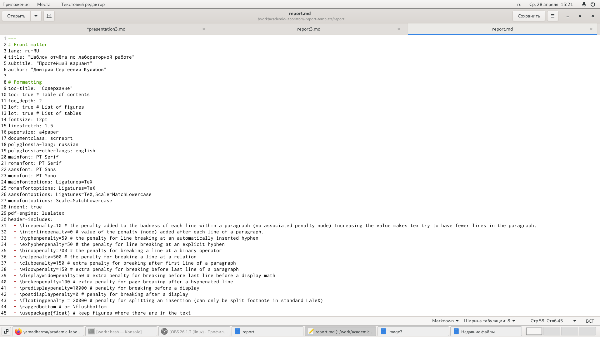
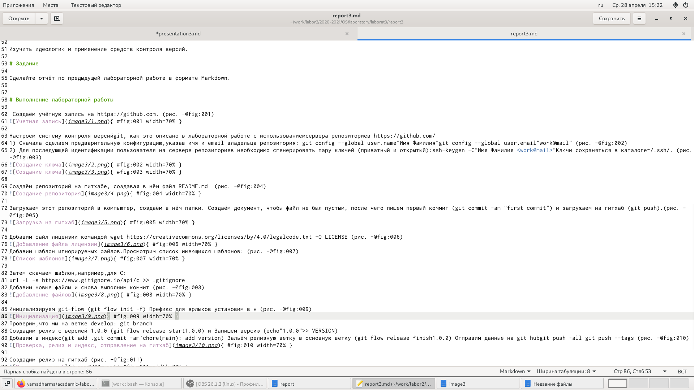
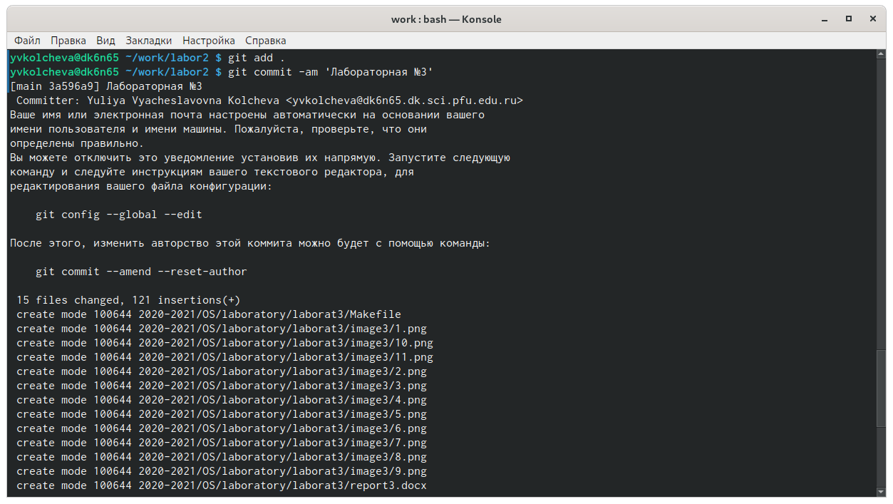

---
## Front matter
lang: ru-RU
title: Операционные системы 
author: Колчева Юлия Вячеславовна
institute: RUDN University, Moscow, Russian Federation

date: 28 апреля 2021 год

## Formatting
toc: false
slide_level: 2
theme: metropolis
header-includes: 
 - \metroset{progressbar=frametitle,sectionpage=progressbar,numbering=fraction}
 - '\makeatletter'
 - '\beamer@ignorenonframefalse'
 - '\makeatother'
aspectratio: 43
section-titles: true
---

# Лабораторная работа №3

## Загрузка шаблона

{ #fig:012 width=70% }
{ #fig:013 width=70% }

## Заполнение отчёта

{ #fig:014 width=70% }
{ #fig:015 width=70% }

{ #fig:014 width=70% }

## Сохранение отчета, отправление на гитхаб

{ #fig:016 width=70% }

## Выводы

Markdown является удобным языком для быстрого и красивого оформления отчётов и презентаций. 
Я научилась оформлять отчёты с помощью легковесного языка разметки Markdown.

## {.standout}

Спасибо за внимание!
