---
# Front matter
lang: ru-RU
title: "Отчёт по лабораторной работе №3"
subtitle: "Диспиплина: Операционные системы"
author: "Колчева Юлия Вячеславовна"

# Formatting
toc-title: "Содержание"
toc: true # Table of contents
toc_depth: 2
lof: true # List of figures
lot: true # List of tables
fontsize: 12pt
linestretch: 1.5
papersize: a4paper
documentclass: scrreprt
polyglossia-lang: russian
polyglossia-otherlangs: english
mainfont: PT Serif
romanfont: PT Serif
sansfont: PT Sans
monofont: PT Mono
mainfontoptions: Ligatures=TeX
romanfontoptions: Ligatures=TeX
sansfontoptions: Ligatures=TeX,Scale=MatchLowercase
monofontoptions: Scale=MatchLowercase
indent: true
pdf-engine: lualatex
header-includes:
  - \linepenalty=10 # the penalty added to the badness of each line within a paragraph (no associated penalty node) Increasing the value makes tex try to have fewer lines in the paragraph.
  - \interlinepenalty=0 # value of the penalty (node) added after each line of a paragraph.
  - \hyphenpenalty=50 # the penalty for line breaking at an automatically inserted hyphen
  - \exhyphenpenalty=50 # the penalty for line breaking at an explicit hyphen
  - \binoppenalty=700 # the penalty for breaking a line at a binary operator
  - \relpenalty=500 # the penalty for breaking a line at a relation
  - \clubpenalty=150 # extra penalty for breaking after first line of a paragraph
  - \widowpenalty=150 # extra penalty for breaking before last line of a paragraph
  - \displaywidowpenalty=50 # extra penalty for breaking before last line before a display math
  - \brokenpenalty=100 # extra penalty for page breaking after a hyphenated line
  - \predisplaypenalty=10000 # penalty for breaking before a display
  - \postdisplaypenalty=0 # penalty for breaking after a display
  - \floatingpenalty = 20000 # penalty for splitting an insertion (can only be split footnote in standard LaTeX)
  - \raggedbottom # or \flushbottom
  - \usepackage{float} # keep figures where there are in the text
  - \floatplacement{figure}{H} # keep figures where there are in the text
---

# Цель работы

Изучить идеологию и применение средств контроля версий.

# Задание

Сделайте отчёт по предыдущей лабораторной работе в формате Markdown.

# Выполнение лабораторной работы

 Создаём учётную запись на https://github.com. (рис. -@fig:001)
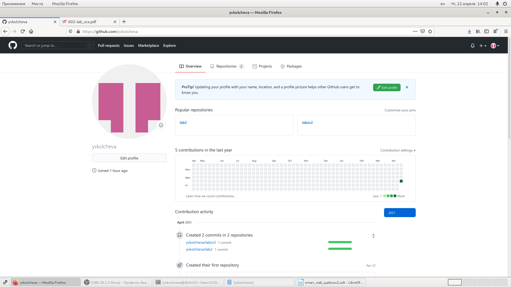{ #fig:001 width=70% }

Настроем систему контроля версийgit, как это описано в лабораторной работе c использованиемсервера репозиториев https://github.com/
1) Сначала сделаем предварительную конфигурацию,указав имя и email владельца репозитория: git config --global user.name"Имя Фамилия"git config --global user.email"work@mail" (рис. -@fig:002)
2) Для последующей идентификации пользователя на сервере репозиториев необходимо сгенерировать пару ключей (приватный и открытый):ssh-keygen -C"Имя Фамилия <work@mail>"Ключи сохраняться в каталоге~/.ssh/. (рис. -@fig:003)
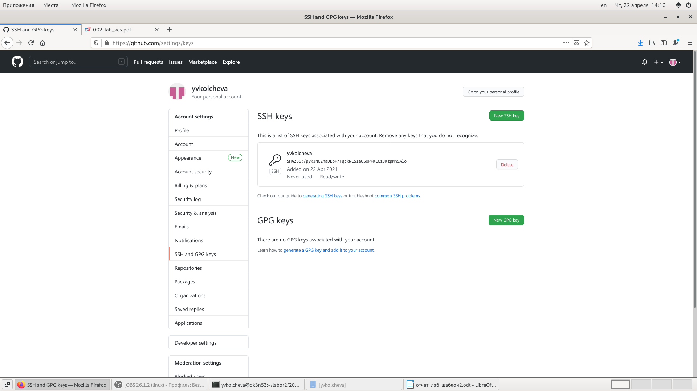{ #fig:002 width=70% }
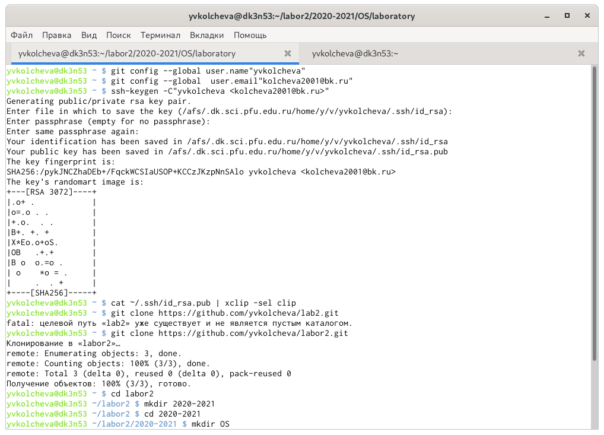{ #fig:003 width=70% }

Создаём репозиторий на гитхабе, создавая в нём файл README.md  (рис. -@fig:004)
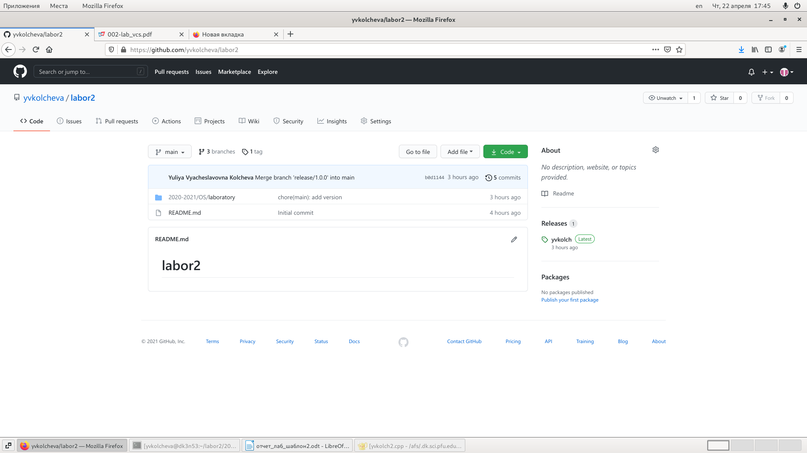{ #fig:004 width=70% }

Загружаем этот репозиторий в компьютер, создаём в нём папки. Создаём документ, чтобы файл не был пустым, после чего пишем первый коммит (git commit -аm "first commit") и загружаем на гитхаб (git push).(рис. -@fig:005)
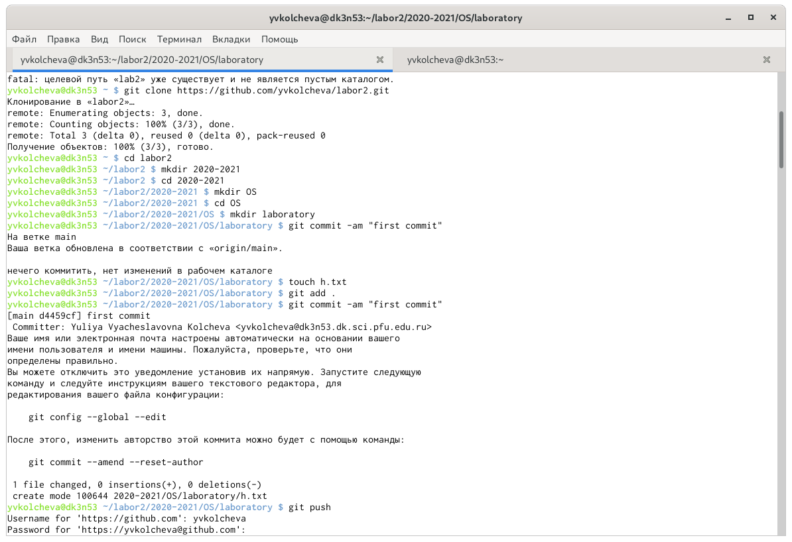{ #fig:005 width=70% }

Добавим файл лицензии командой wget https://creativecommons.org/licenses/by/4.0/legalcode.txt -O LICENSE (рис. -@fig:006)
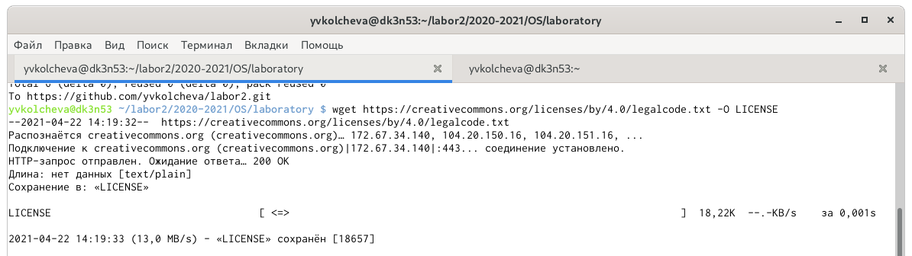{ #fig:006 width=70% }
Добавим шаблон игнорируемых файлов.Просмотрим список имеющихся шаблонов: (рис. -@fig:007)
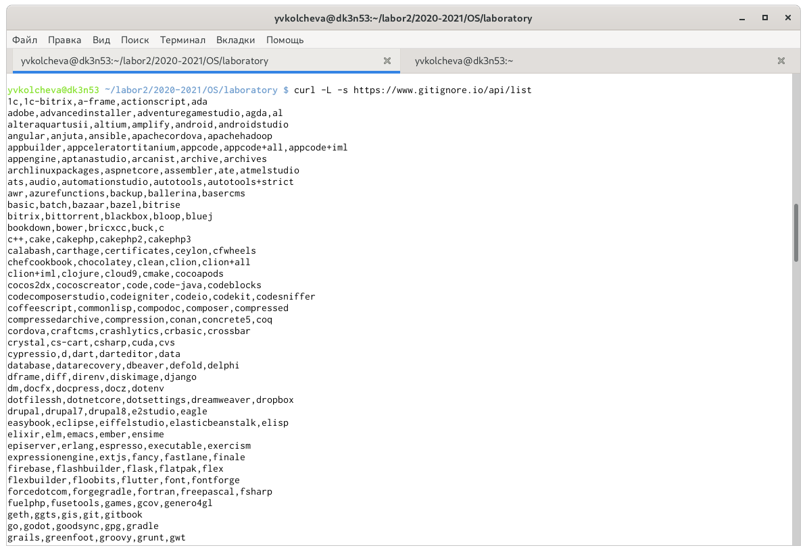{ #fig:007 width=70% }

Затем скачаем шаблон,например,для C:
url -L -s https://www.gitignore.io/api/c >> .gitignore
Добавим новые файлы и снова выполним коммит (рис. -@fig:008)
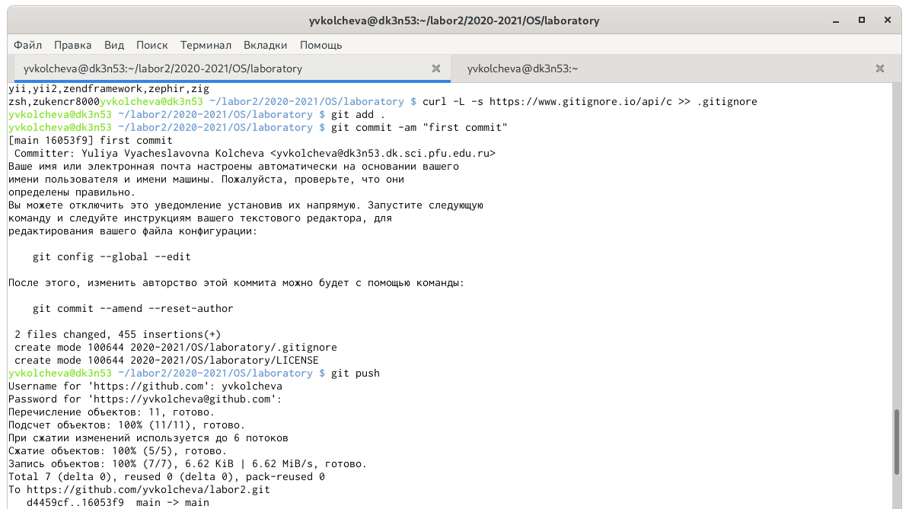{ #fig:008 width=70% }

Инициализируем git-flow (git flow init -f) Префикс для ярлыков установим в v (рис. -@fig:009)
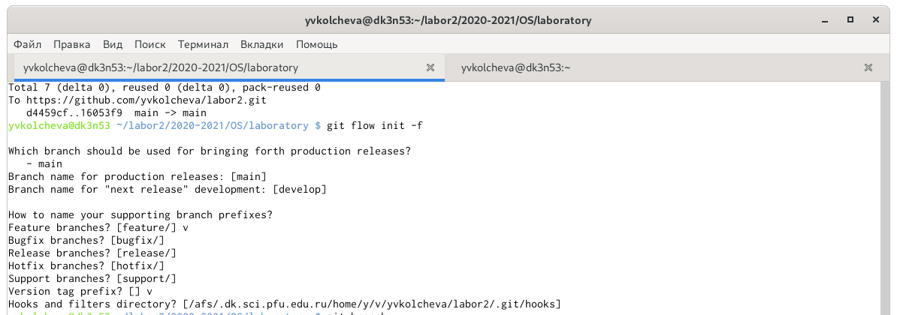{ #fig:009 width=70% }
Проверим,что мы на ветке develop: git branch
Создадим релиз с версией 1.0.0 (git flow release start1.0.0) и Запишем версию (echo"1.0.0">> VERSION)
Добавим в индекс(git add .git commit -am'chore(main): add version) Зальём релизную ветку в основную ветку (git flow release finish1.0.0) Отправим данные на git hubgit push –all git push --tags (рис. -@fig:010)
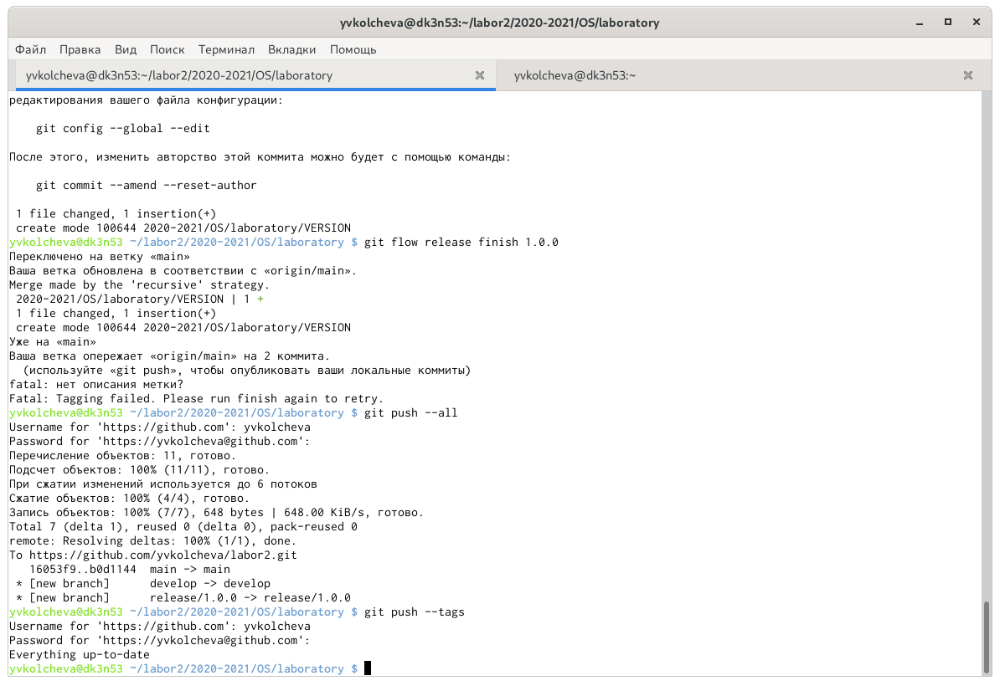{ #fig:010 width=70% }

Создадим релиз на гитхаб (рис. -@fig:011) 
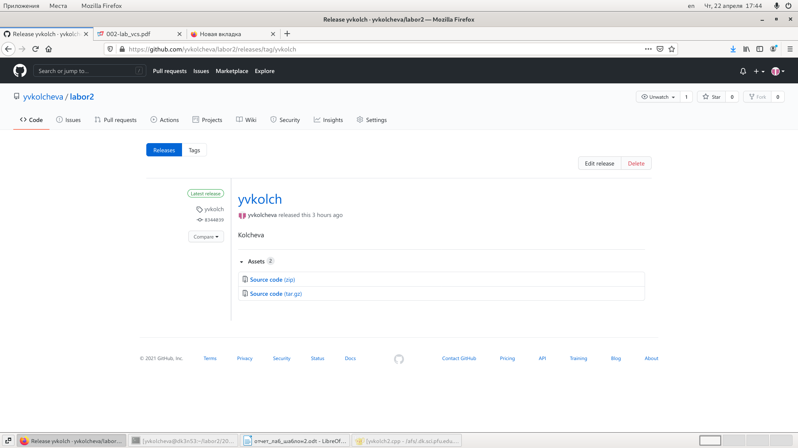{ #fig:011 width=70% }

# Выводы

 Мы изучили идеологию и применение средств контроля версий.
