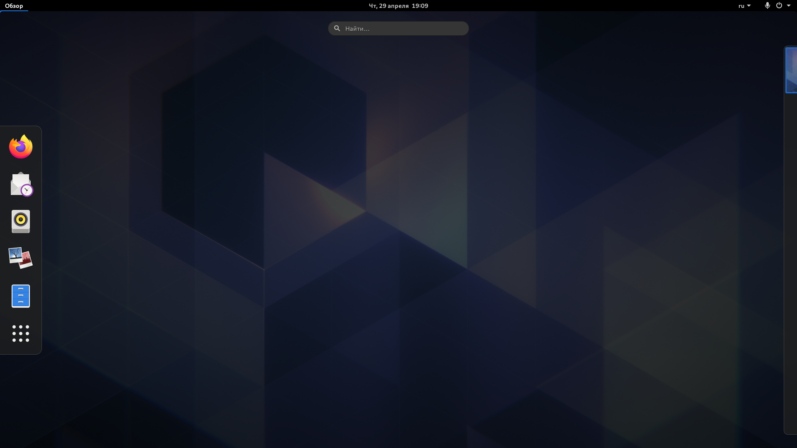
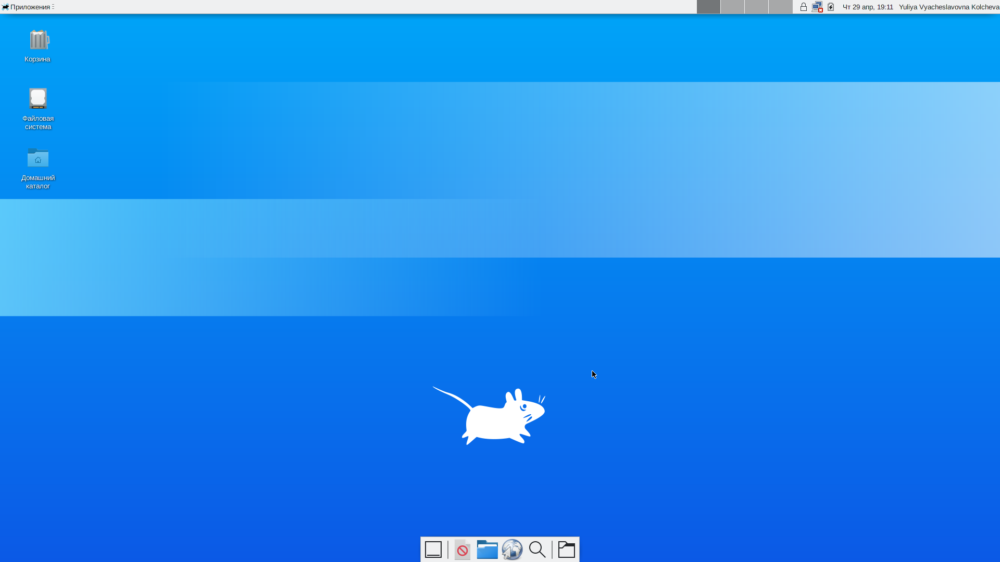
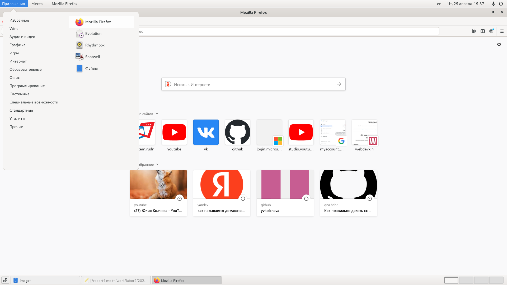
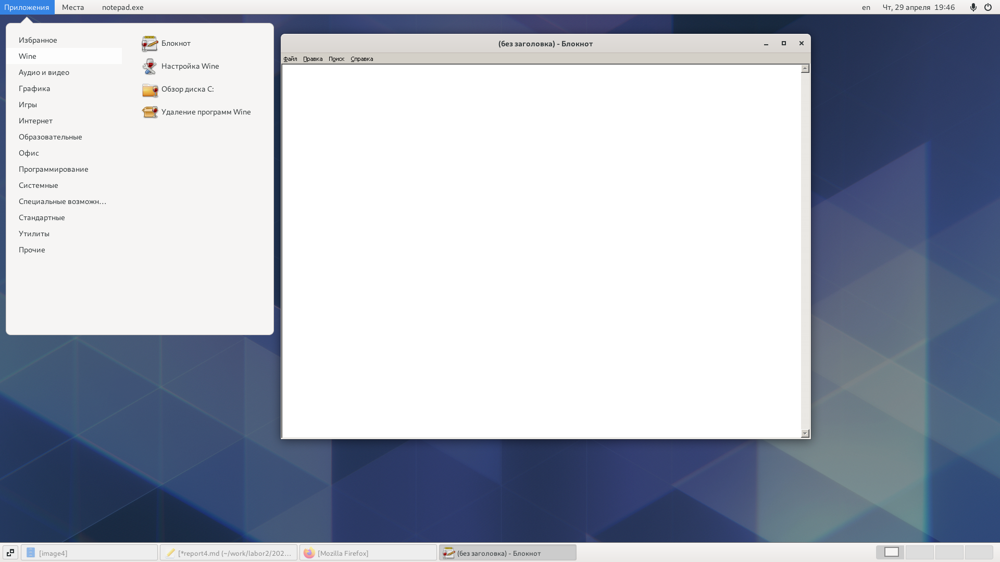
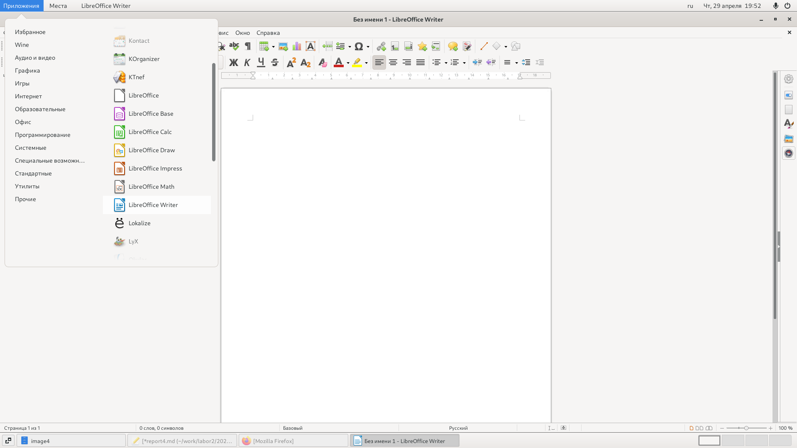
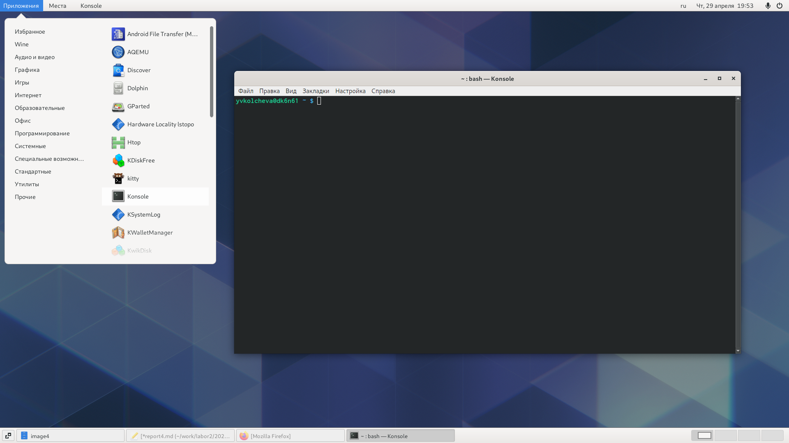

---
## Front matter
lang: ru-RU
title: Операционные системы 
author: Колчева Юлия Вячеславовна
institute: RUDN University, Moscow, Russian Federation

date: 29 апреля 2021 год

## Formatting
toc: false
slide_level: 2
theme: metropolis
header-includes: 
 - \metroset{progressbar=frametitle,sectionpage=progressbar,numbering=fraction}
 - '\makeatletter'
 - '\beamer@ignorenonframefalse'
 - '\makeatother'
aspectratio: 43
section-titles: true
---

# Лабораторная работа №4

## Текстовая консоль

Для начала мы знакомимся с теоретическим материалом на ТУИС и загружаем компьютер. 

Переходим в тестовую консоль при помощи сочетания клавиш ctrl+alt+Fn, где n - это номер консоли от 1 до 6. Всего существует шесть консолей. 

Чтобы перемешаться между текстовыми консолями, нужно нажать сочетание alt+Fn, где n - это номер консоли от 1 до 6.

Далее мы регистрируемся в операционной системе, используя личные логин и пароль от дисплейных классов. При вводе пароля символы не отражаются. 
Завершая работу с консолью, мы нажимаем клавиши ctrl+D или можем ввести команду logout.

Чтобы переключиться на графический интерфейс мы исползуем комбинацию ctrl+alt+F7. 

## Работа с менеджерами рабочих столов

Поочерёдно регестрируемся в разных менеджерах и ознакамливаемся с ними. 
GNOME(рис. -@fig:002)
{ #fig:002 width=70% }
Менеджера KDE не было в наличии, поэтому его мы пропускаем.
Менеджер XFCE(рис. -@fig:003)
{ #fig:003 width=70% }
На компьютере были установлены следующие менеджеры:GNOME, Классический GNOME, GNOME на Xorg, GNOME/Openbox,Openbox, MATE, Plasma, Plasma(Wayland),XSession, awesome, cеанс XFCE.
Менеджер Openbox представляет собой чёрный экран, где я не могу сделать скриншот.

## Теперь изучаем список установленных программ.

Для начала откроем браузер - Mozilla Firefox, мы можем это сделать из "Программы" "Избранное". (рис. -@fig:004)
{ #fig:004 width=70% }
Теперь откроем текстовый редактор - блокнот."Программы" "Wine"(рис. -@fig:005)
{ #fig:005 width=70% }
Теперь откроем текстовый процессор - LibreOffice."Программы" "Офис"(рис. -@fig:006)
{ #fig:006 width=70% }
Теперь откроем эмулятор консоли - консоль."Программы" "Системные"(рис. -@fig:007)
{ #fig:007 width=70% }

## Выводы

Я познакомилась с операционной системой Linux,получить практические навыки работы с консолью и некоторыми графическими менеджерами рабочих столов операционной системы.

## {.standout}

Спасибо за внимание!
