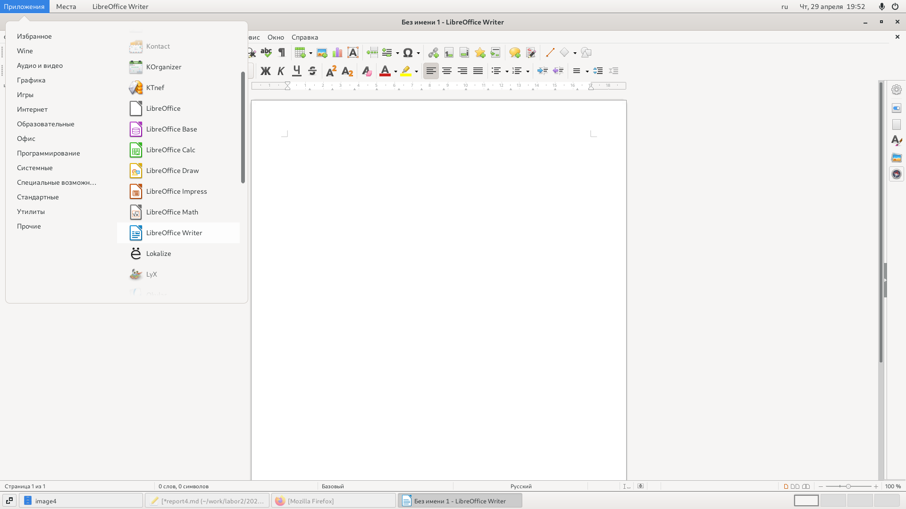

---
# Front matter
lang: ru-RU
title: "Лабораторная работа №4"
subtitle: "Дисциплина: Операционные системы"
author: "Колчева Юлия вячеславовна"

# Formatting
toc-title: "Содержание"
toc: true # Table of contents
toc_depth: 2
lof: true # List of figures
lot: true # List of tables
fontsize: 12pt
linestretch: 1.5
papersize: a4paper
documentclass: scrreprt
polyglossia-lang: russian
polyglossia-otherlangs: english
mainfont: PT Serif
romanfont: PT Serif
sansfont: PT Sans
monofont: PT Mono
mainfontoptions: Ligatures=TeX
romanfontoptions: Ligatures=TeX
sansfontoptions: Ligatures=TeX,Scale=MatchLowercase
monofontoptions: Scale=MatchLowercase
indent: true
pdf-engine: lualatex
header-includes:
  - \linepenalty=10 # the penalty added to the badness of each line within a paragraph (no associated penalty node) Increasing the value makes tex try to have fewer lines in the paragraph.
  - \interlinepenalty=0 # value of the penalty (node) added after each line of a paragraph.
  - \hyphenpenalty=50 # the penalty for line breaking at an automatically inserted hyphen
  - \exhyphenpenalty=50 # the penalty for line breaking at an explicit hyphen
  - \binoppenalty=700 # the penalty for breaking a line at a binary operator
  - \relpenalty=500 # the penalty for breaking a line at a relation
  - \clubpenalty=150 # extra penalty for breaking after first line of a paragraph
  - \widowpenalty=150 # extra penalty for breaking before last line of a paragraph
  - \displaywidowpenalty=50 # extra penalty for breaking before last line before a display math
  - \brokenpenalty=100 # extra penalty for page breaking after a hyphenated line
  - \predisplaypenalty=10000 # penalty for breaking before a display
  - \postdisplaypenalty=0 # penalty for breaking after a display
  - \floatingpenalty = 20000 # penalty for splitting an insertion (can only be split footnote in standard LaTeX)
  - \raggedbottom # or \flushbottom
  - \usepackage{float} # keep figures where there are in the text
  - \floatplacement{figure}{H} # keep figures where there are in the text
---

# Цель работы

Познакомиться с операционной системой Linux,получить практические навыки работы с консолью и некоторыми графическими менеджерами рабочих столов операционной системы.

# Выполнение лабораторной работы

Для начала мы знакомимся с теоретическим материалом на ТУИС и загружаем компьютер. 

Переходим в тестовую консоль при помощи сочетания клавиш ctrl+alt+Fn, где n - это номер консоли от 1 до 6. Всего существует шесть консолей. 

Чтобы перемешаться между текстовыми консолями, нужно нажать сочетание alt+Fn, где n - это номер консоли от 1 до 6.

Далее мы регистрируемся в операционной системе, используя личные логин и пароль от дисплейных классов. При вводе пароля символы не отражаются. 
Завершая работу с консолью, мы нажимаем клавиши ctrl+D или можем ввести команду logout.

Чтобы переключиться на графический интерфейс мы исползуем комбинацию ctrl+alt+F7. 

Теперь переходим к ознакомлению с менеджерами рабочих столов. Менеджер, запускаемый по умолчанию называется Классический GNOME (рис. -@fig:001)
{ #fig:001 width=70% }

Теперь поочерёдно регестрируемся в разных менеджерах и ознакамливаемся с ними. 
GNOME(рис. -@fig:002)
{ #fig:002 width=70% }
Менеджера KDE не было в наличии, поэтому его мы пропускаем.
Менеджер XFCE(рис. -@fig:003)
{ #fig:003 width=70% }
На компьютере были установлены следующие менеджеры:GNOME, Классический GNOME, GNOME на Xorg, GNOME/Openbox,Openbox, MATE, Plasma, Plasma(Wayland),XSession, awesome, cеанс XFCE.
Менеджер Openbox представляет собой чёрный экран, где я не могу сделать скриншот. 

Теперь изучаем список установленных программ. Обращаем внимание на предпочтительные программы для разных применений. 
Для начала откроем браузер - Mozilla Firefox, мы можем это сделать из "Программы" "Избранное". (рис. -@fig:004)
{ #fig:004 width=70% }
Теперь откроем текстовый редактор - блокнот."Программы" "Wine"(рис. -@fig:005)
{ #fig:005 width=70% }
Теперь откроем текстовый процессор - LibreOffice."Программы" "Офис"(рис. -@fig:006)
{ #fig:006 width=70% }
Теперь откроем эмулятор консоли - консоль."Программы" "Системные"(рис. -@fig:007)
{ #fig:007 width=70% }

# Выводы

Я познакомилась с операционной системой Linux,получить практические навыки работы с консолью и некоторыми графическими менеджерами рабочих столов операционной системы.
