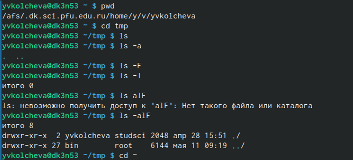
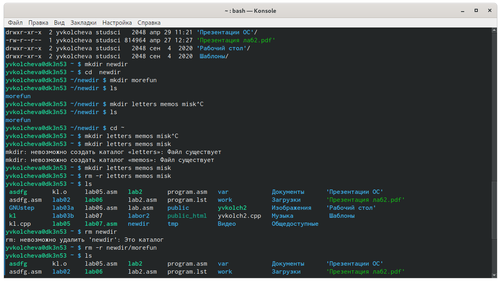
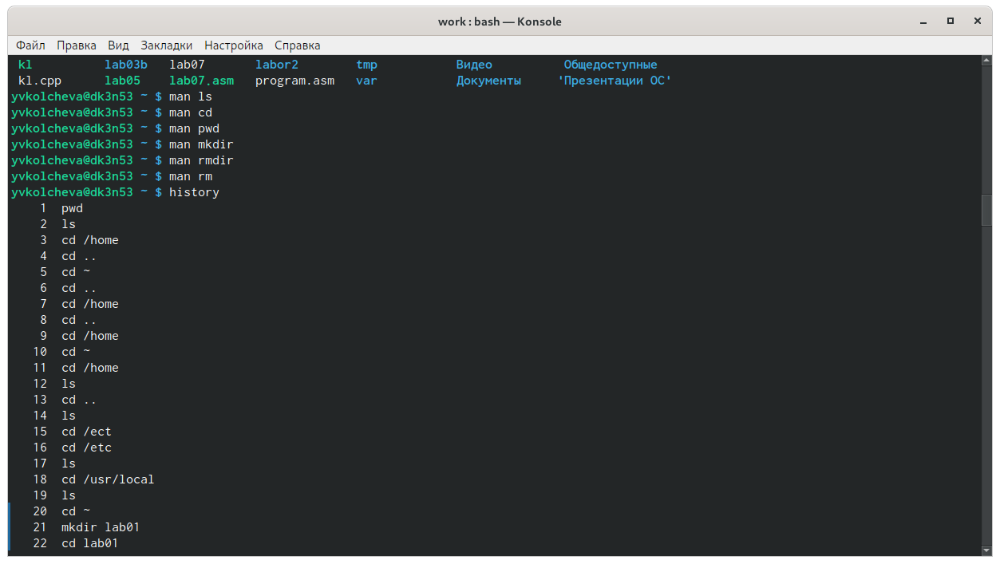
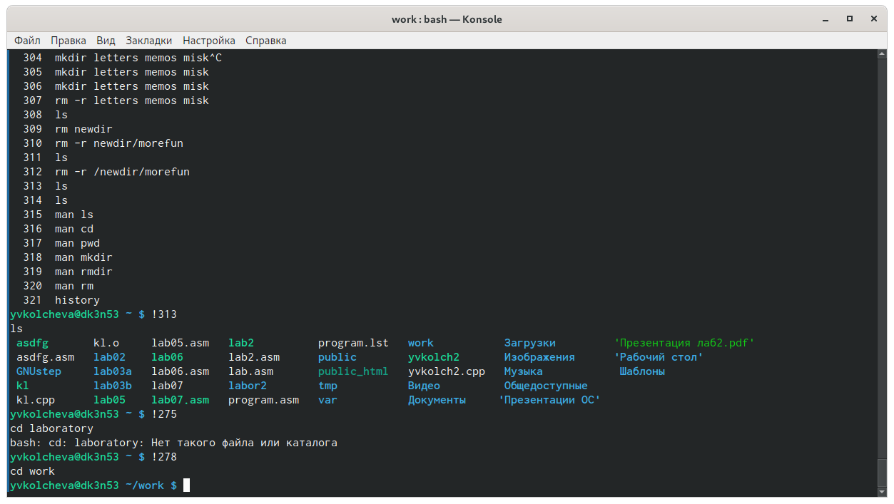

---
## Front matter
lang: ru-RU
title: Операционные системы 
author: Колчева Юлия Вячеславовна
institute: RUDN University, Moscow, Russian Federation

date: 11 мая 2021 год

## Formatting
toc: false
slide_level: 2
theme: metropolis
header-includes: 
 - \metroset{progressbar=frametitle,sectionpage=progressbar,numbering=fraction}
 - '\makeatletter'
 - '\beamer@ignorenonframefalse'
 - '\makeatother'
aspectratio: 43
section-titles: true
---

# Лабораторная работа №5

## Команды pwd и ls

Для начала мы определяем имя домашнего каталога, использовав команду "pwd" в домашнем каталоге (~). (рис. -@fig:001)
Переходим в каталог /tmp, используя команду "cd/tmp". Выводим содержимое каталога /tmp, используя команду «ls» с различными опциями: (рис. -@fig:001)

{ #fig:001 width=70% }

## Создание и удаление файлов

В домашнем каталоге создаем новый каталог newdir, используя команду «mkdir newdir». (рис. -@fig:004) Убеждаемся, что каталог создан, с помощью команды «ls». Командой «cd newdir» переходим в ранее созданный каталог и там создаем каталог morefun, используя команду "mkdir morefun". Командой «ls» проверяем правильность выполненных действий. (рис. -@fig:004) Используя команду «mkdir letter smemos misk»,создаем в домашнем каталоге три новых. Далее с помощью команды «rm –r letter smemos misk» удаляем созданные каталоги. Командой «ls» проверяем правильность выполненных действий.(рис. -@fig:004)
Пробуем удалить каталог newdir командой «rm newdir». Получаем отказ  в  выполнении  команды, потому что данный каталог содержит подкаталог morefun и при удалении нужно использовать опцию -r (рис. -@fig:004)
даляем  каталог newdir/morefun,  используя команду  «rm –r newdir/morefun». Командой «ls» проверяем правильность выполненного действия (рис. -@fig:004)

{ #fig:004 width=70% }

## Команда "history"

Выведем историю команд с помощью команды «history». Далее,  используя  команды,  «!313» и  «!278», выполним команды под этими номерами.(рис. -@fig:013)(рис. -@fig:014)

{ #fig:013 width=70% }

{ #fig:014 width=70% }

## Выводы
В ходе выполнения данной лабораторной работы я приобрела практические навыки взаимодействия с системой посредством командной строки.

## {.standout}

Спасибо за внимание!
