---
# Front matter
lang: ru-RU
title: "Лабораторная работа №5"
subtitle: "Дисциплина: Операционные системы"
author: "Колчева Юлия вячеславовна"

# Formatting
toc-title: "Содержание"
toc: true # Table of contents
toc_depth: 2
lof: true # List of figures
lot: true # List of tables
fontsize: 12pt
linestretch: 1.5
papersize: a4paper
documentclass: scrreprt
polyglossia-lang: russian
polyglossia-otherlangs: english
mainfont: PT Serif
romanfont: PT Serif
sansfont: PT Sans
monofont: PT Mono
mainfontoptions: Ligatures=TeX
romanfontoptions: Ligatures=TeX
sansfontoptions: Ligatures=TeX,Scale=MatchLowercase
monofontoptions: Scale=MatchLowercase
indent: true
pdf-engine: lualatex
header-includes:
  - \linepenalty=10 # the penalty added to the badness of each line within a paragraph (no associated penalty node) Increasing the value makes tex try to have fewer lines in the paragraph.
  - \interlinepenalty=0 # value of the penalty (node) added after each line of a paragraph.
  - \hyphenpenalty=50 # the penalty for line breaking at an automatically inserted hyphen
  - \exhyphenpenalty=50 # the penalty for line breaking at an explicit hyphen
  - \binoppenalty=700 # the penalty for breaking a line at a binary operator
  - \relpenalty=500 # the penalty for breaking a line at a relation
  - \clubpenalty=150 # extra penalty for breaking after first line of a paragraph
  - \widowpenalty=150 # extra penalty for breaking before last line of a paragraph
  - \displaywidowpenalty=50 # extra penalty for breaking before last line before a display math
  - \brokenpenalty=100 # extra penalty for page breaking after a hyphenated line
  - \predisplaypenalty=10000 # penalty for breaking before a display
  - \postdisplaypenalty=0 # penalty for breaking after a display
  - \floatingpenalty = 20000 # penalty for splitting an insertion (can only be split footnote in standard LaTeX)
  - \raggedbottom # or \flushbottom
  - \usepackage{float} # keep figures where there are in the text
  - \floatplacement{figure}{H} # keep figures where there are in the text
---

# Цель работы

Приобретение практических навыков взаимодействия пользователя с системой посредством командной строки.

# Выполнение лабораторной работы

Для начала мы определяем имя домашнего каталога, использовав команду "pwd" в домашнем каталоге (~). (рис. -@fig:001)
Переходим в каталог /tmp, используя команду "cd/tmp". Выводим содержимое каталога /tmp, используя команду «ls» с различными опциями: (рис. -@fig:001)
«ls» − выводится список каталогов и файлов, которые можно увидеть в каталоге tmp.
«ls -a» − к списку каталогов и файлов добавляются скрытые каталоги и файлы.
«ls -F» − с помощью этой команды получаем информацию  о типах файлов.
«ls -l» − получаем список каталогов и файлов с  более подробной информацией о них.
«ls -alF» − данная  команда отобразит список всех каталогов и файлов, в том числе и скрытых, с подробной информацией о них. (рис. -@fig:001)
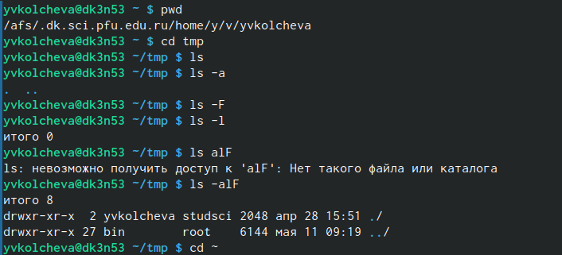 { #fig:001 width=70% }

Чтобы определить, есть ли в /var/spool подкаталог с именем cron, перейдем в указанный каталог с помощью команды "cd /var/spool", просмотрим его содержимое, используя команду «ls». Убедимся, что такой каталог действительно существует. (рис. -@fig:002)
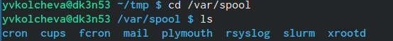{ #fig:002 width=70% }

Далее  переходим  в свой домашний каталог с помощью команды «cd ~» и, используя команду  «ls -alF», вывожу на экран  его содержимое. Из рисунка видно, что владельцем всех каталогов и файлов, кроме родительского каталога является  пользователь yvkolcheva из группы пользователей studsci (рис. -@fig:003)
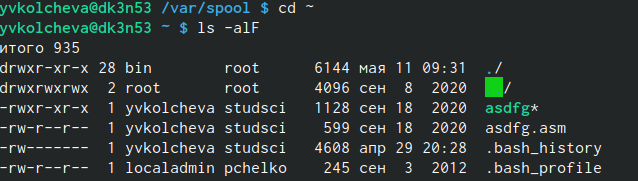{ #fig:003 width=70% }
В домашнем каталоге создаем новый каталог newdir, используя команду «mkdir newdir». (рис. -@fig:004) Убеждаемся, что каталог создан, с помощью команды «ls». Командой «cd newdir» переходим в ранее созданный каталог и там создаем каталог morefun, используя команду "mkdir morefun". Командой «ls» проверяем правильность выполненных действий. (рис. -@fig:004) Используя команду «mkdir letter smemos misk»,создаем в домашнем каталоге три новых. Далее с помощью команды «rm –r letter smemos misk» удаляем созданные каталоги. Командой «ls» проверяем правильность выполненных действий.(рис. -@fig:004)
Пробуем удалить каталог newdir командой «rm newdir». Получаем отказ  в  выполнении  команды, потому что данный каталог содержит подкаталог morefun и при удалении нужно использовать опцию -r (рис. -@fig:004)
даляем  каталог newdir/morefun,  используя команду  «rm –r newdir/morefun». Командой «ls» проверяем правильность выполненного действия (рис. -@fig:004)

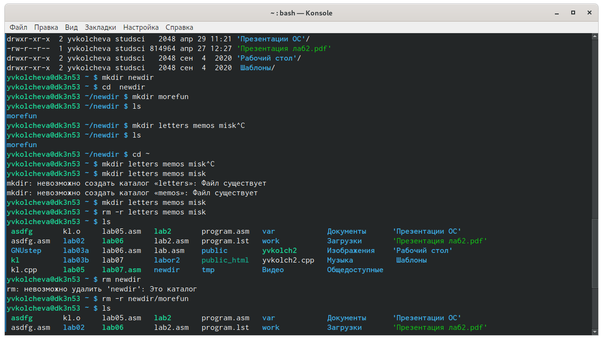{ #fig:004 width=70% }
Используя команду «manls», определяю, какую опцию команды ls необходимо использовать, чтобы просмотреть содержимое не только указанного каталога, но и подкаталогов, входящих в него.
(рис. -@fig:005)
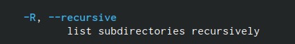{ #fig:005 width=70% }
Используя то же руководство по команде «ls», открытое в предыдущем пункте,  определяю  набор  опций  команды ls, позволяющий отсортировать по  времени  последнего  изменения  выводимый  список содержимого каталога с развернутым описанием файлов (рис. -@fig:006) (рис. -@fig:007) (рис. -@fig:008)
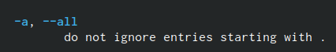{ #fig:006 width=70% }
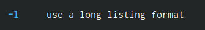{ #fig:007 width=70% }
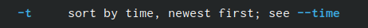{ #fig:008 width=70% }
Используя команды «man cd», «man pwd», «man mkdir», «man rmdir», «man rm», просматриваем описание соответствующих команд.
Команда cd не имеет дополнительных опций.

Команда pwd:(рис. -@fig:009)
-L, --logical не разыменовывать символические ссылки. Если путь содержит символические  ссылки, то выводить их безпреобразования в исходный путь;
-P, --physical преобразовывать символические ссылки в исходные имена. Если путь содержит символические ссылки, то они будут преобразованы в названия исходных директорий, на которые они указывают;
--help показать справку по команде pwd;
--version показать версию утилиты pwd;
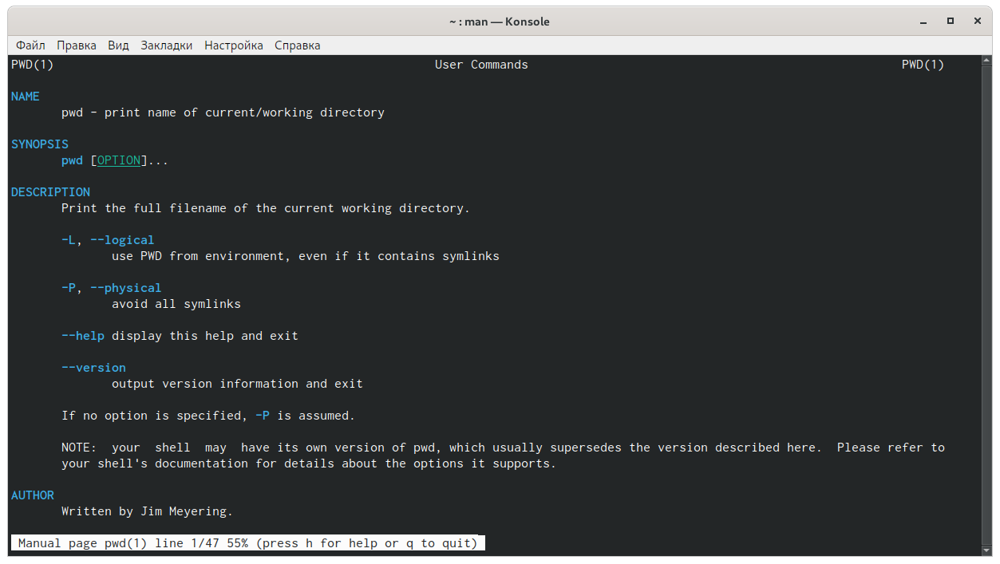{ #fig:009 width=70% }

Команда mkdir (рис. -@fig:010)
-m,--mode=MODE устанавливает  права  доступа  для  создаваемой  директории. Синтаксис MODE такой же как у команды chmod;
-p,--parents создать  все  директории,  которые  указаны  внутри  пути.  Если какая-либо директория существует, то предупреждение об этом не выводится;
-v, --verbose выводить сообщение о каждой создаваемой директории;
-z установить  контекст  SELinux  для  создаваемой  директории  по умолчанию;
--context[=CTX] установить  контекст  SELinux  для  создаваемой  директории  в значение CTX;
--help показать справку по команде mkdir;
--version показать версию утилиты mkdir;
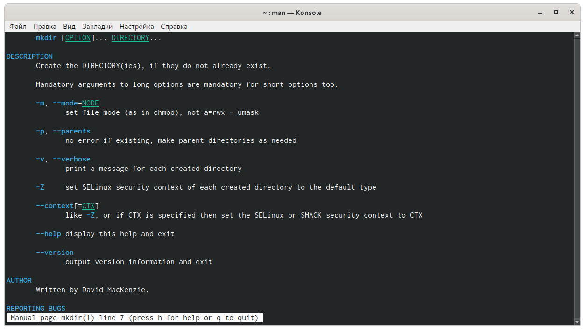{ #fig:010 width=70% }

Команда rmdir (рис. -@fig:011):
--ignore-fail-on-non-emptyигнорировать директории, которые содержат в себе файлы;
-p, --parentsв  этой  опции  каждый  аргумент  каталога  обрабатывается  как путь, из которого будут удалены все компоненты, если они уже пусты, начиная с последнего компонента;
-v, --verboseотображение    подробной    информациидля    каждого обрабатываемого каталога;
--help показать справку по команде rmdir;
--version показать версию утилиты rmdir
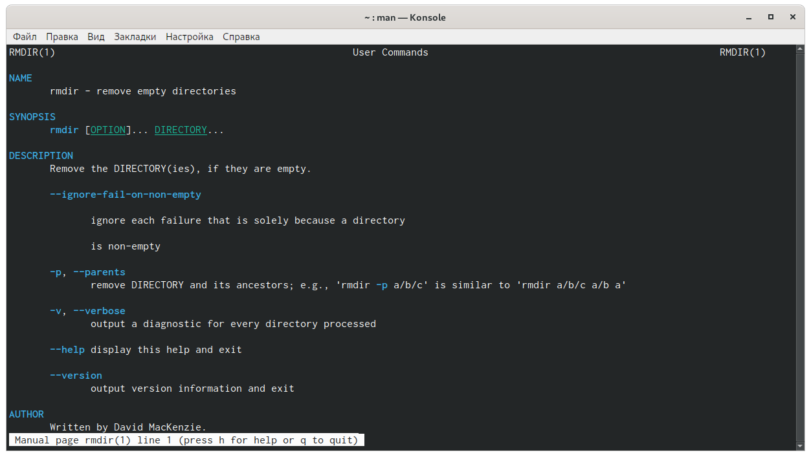{ #fig:011 width=70% }

Команда rm: (рис. -@fig:012)
-f, --force игнорировать несуществующие файлы и аргументы. Никогда не выдавать запросы на подтверждение удаления;
-i выводить запрос на подтверждение удаления каждого файла;
-I выдать  один  запрос  на  подтверждение  удаления  всех  файлов, если  удаляется  больше  трех  файлов  или  используется рекурсивное   удаление.   Опция   применяется,   как   более «щадящая» версия опции –i;
--interactive[=WHEN] вместо WHEN можно использовать:never —никогда  не  выдавать  запросы  на  подтверждение удаления.once —выводить запрос один раз (аналог опции -I).
--one-file-systemво  время  рекурсивного  удаления  пропускать  директории, которые находятся на других файловых системах;
--no-preserve-root если в качестве директории для удаления задан корневой раздел /, то считать, что это обычная директория и начать выполнять удаление;
--preserve-root[=all] если в качестве директории для удаления задан корневой раздел /, то запретить выполнять команду rm над корневым разделом. Данное поведение используется по умолчанию;
-r, -R, --recursive удаление директорий и их содержимого. Рекурсивное удаление;
-d, --dirудалять пустые директории;
-v, --verbose выводить информацию об удаляемых файлах;
--help показать справку по команде rm;
--version показать версию утилиты rm
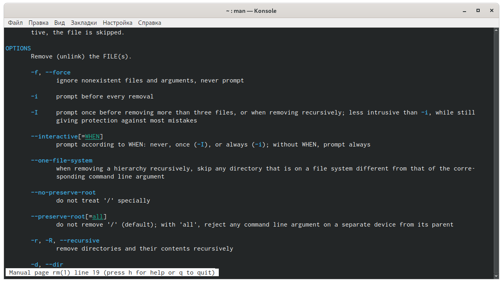{ #fig:012 width=70% }

Выведем историю команд с помощью команды «history». Далее,  используя  команды,  «!313» и  «!278», выполним команды под этими номерами.(рис. -@fig:013)(рис. -@fig:014)
{ #fig:013 width=70% }
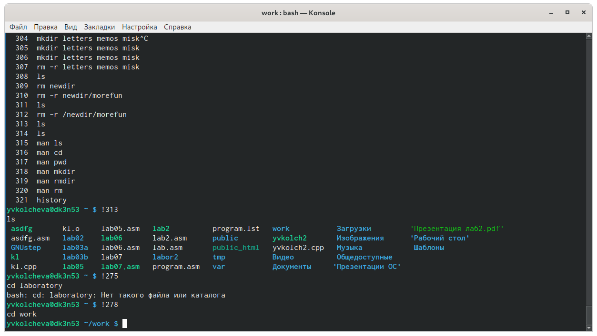{ #fig:014 width=70% }

# Выводы
В ходе выполнения данной лабораторной работы я приобрела практические навыки взаимодействия с системой посредством командной строки.

# Контрольные вопросы
Ответы на контрольные вопросы:
1)Команднаястрока–специальная  программа, позволяющая  управлять операционной  системой  при  помощи  текстовых  команд,  вводимых  в окне приложения.
2)Для определения абсолютного пути к текущему каталогу используется команда  pwd  (print  working  directory).  Например,  команда  «pwd»  в моем домашнем каталоге выведет: /home/kaleontjeva
3)Команда  «ls-F» (или  «ls-aF»,  тогда  появятся  еще  скрытые  файлы) выведет имена файлов в текущем каталоге и их типы. Тип каталога обозначается /, тип исполняемого файла обозначается *, тип ссылки обозначается @.
4)Имена  скрытых  файлов  начинаются  с  точки.  Эти  файлы  в операционной системе скрыты от просмотра и обычно используются для  настройки  рабочей  среды.  Для  того,  чтобы  отобразить  имена скрытых файлов, необходимо использовать команду «ls –a». 
5)Команда  rm  используется  для  удаления  файлов  и/или  каталогов. Команда rm-iвыдает  запрос  подтверждения  наудаление  файла. Команда rm-rнеобходима, чтобы удалить каталог, содержащий файлы. Без указания этой опции команда не будет выполняться. Если каталог пуст,  то  можно  воспользоваться  командой  rmdir.  Если  удаляемый каталог  содержит  файлы,  то  команда  не  будетвыполнена –нужно использовать «rm -r имя_каталога».Таким  образом,  каталог,  не  содержащий  файлов,  можно  удалить  и командой rm, и командой rmdir. Файл командой rmdirудалить нельзя.
6)Чтобы  определить,  какие  команды  выполнил  пользователь  в  сеансе работы, необходимо воспользоваться командой «history».
7)Чтобы  исправить  илизапустить  на  выполнение  команду,  которую пользователь уже использовал в сеансе работы, необходимо: в первом случае:воспользоваться конструкцией !<номер_команды>:s/<что_меняем>/<на_что_меняем>,   во   втором случае: !<номер_команды>. 
8)Чтобы записать в одной строке несколько команд, необходимо между ними поставить ; . Например, «cd /tmp; ls».
9)Символ  обратного  слэша позволяет  использовать  управляющие символы  (".",  "/",  "$",  "*",  "[",  "]",  "^",  "&")  без  их  интерпретации командной оболочкой; процедура  добавления данного  символа  перед управляющими  символами  называетсяэкранированием  символов.Например,  команда  «lsnewdir\/morefun»  отобразит  содержимое каталога newdir morefun.
10)Команда «ls -l» отображает список каталогов и файлов с подробной информацией  о  них(тип  файла,  право  доступа, число  ссылок, владелец, размер, дата последней ревизии, имя файла или каталога).
11)Полный, абсолютный путь от корня файловой системы –этот путь начинается от корня "/" и описывает весь путь к файлуили каталогу; Относительный  путь–это  путь  к файлу  относительно  текущего каталога(каталога,  где  находится  пользователь).Например, «cd/newdir/morefun»–абсолютный  путь,  «cdnewdir»–относительный путь.
12)Чтобы получить необходимую информацию о команде, необходимо воспользоваться конструкцией man[имя_команды], либо использовать опцию help, которая предусмотрена для некоторых команд.
13)Для автоматического дополнения вводимых команд служит клавиша Tab.

