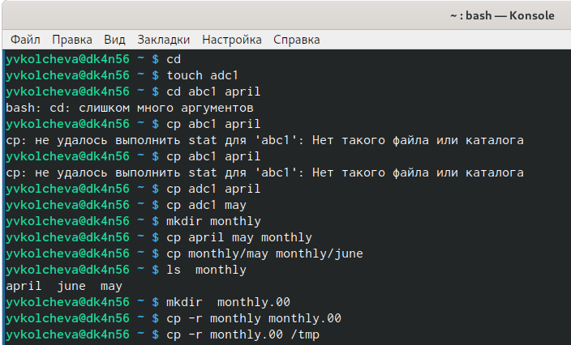
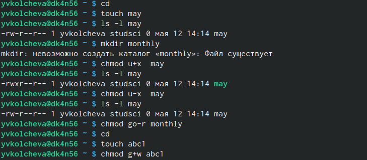
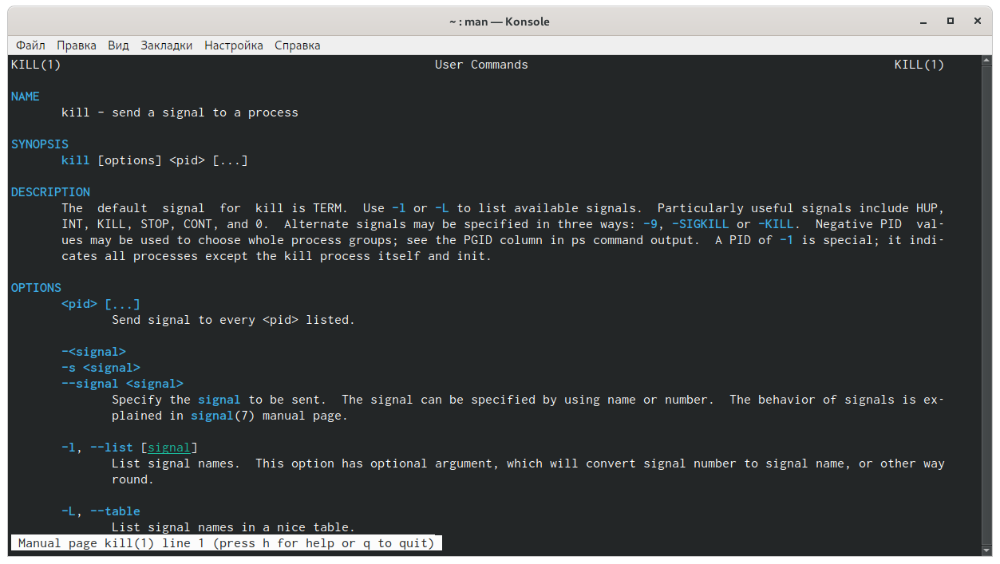
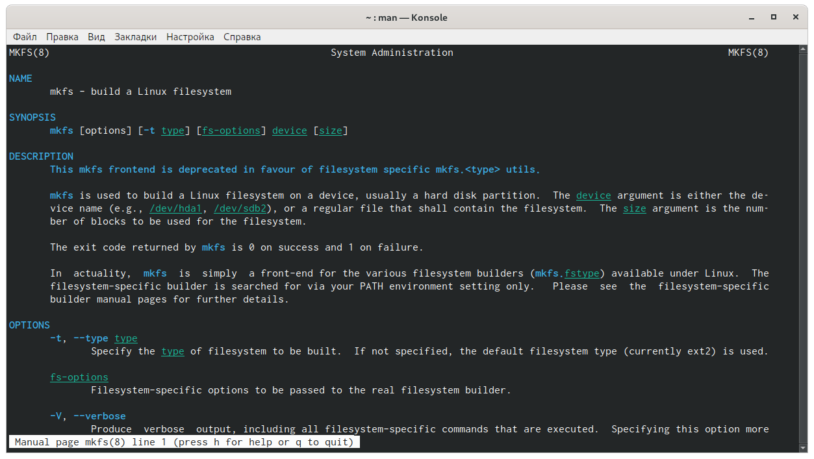

---
## Front matter
lang: ru-RU
title: Операционные системы 
author: Колчева Юлия Вячеславовна
institute: RUDN University, Moscow, Russian Federation

date: 11 мая 2021 год

## Formatting
toc: false
slide_level: 2
theme: metropolis
header-includes: 
 - \metroset{progressbar=frametitle,sectionpage=progressbar,numbering=fraction}
 - '\makeatletter'
 - '\beamer@ignorenonframefalse'
 - '\makeatother'
aspectratio: 43
section-titles: true
---

# Лабораторная работа №6

## Выполнение первой части
1) Скопируем  файл  "~/abc1"  в  файл  april и  в  файл "may".  Для  этого создадим  файл "abc1" (touch abc1),  далее осуществим копирование (cp abc1 april и cp abc1 may). (рис. -@fig:001)
2) Скопируем файлы "april" и "may" в каталог monthly (mkdir monthly − создаём каталог monthly и  cp april may monthly − копируем).(рис. -@fig:001)

{ #fig:001 width=70% }

## Права доступа

1) Создадим файл  "~/may"  с  правом  выполнения  для  владельца.  Для этого выполним следующие команды: «touch may», «ls -l may» , «chmod u+x may», «ls -l may». (рис. -@fig:003)
2) Лишаемвладельца файла  "~/may" права на выполнение,  используя команды: «chmod u-x may»,  «ls -l  may» . (рис. -@fig:003)
3) Создаем каталог monthly с запретом на чтение для членов группы и всех остальных пользователей. Выполняем команды: «mkdir  monthly», «chmodgo -r monthly». (рис. -@fig:003)
4) Создаем файл "~/abc1" с правом записи для членов группы, используя команды: «touch abc1», «chmod g+w abc1». (рис. -@fig:003)

{ #fig:003 width=70% }

## Команда man

Используя команды «man mount», «man fsck»,«man mkfs»,«man kill», получим  информацию  о  соответствующих командах..(рис. -@fig:013)(рис. -@fig:012)

{ #fig:013 width=70% }

{ #fig:012 width=70% }

## Выводы
В ходе выполнения лабораторной работы я ознакомиласьс файловой системой  Linux, её структурой, именами и содержанием каталогов, получила навыкипо применению команд для работы с файлами и каталогами, по управлению процессами, по проверке использования диска и обслуживанию файловой системы.

## {.standout}

Спасибо за внимание!
