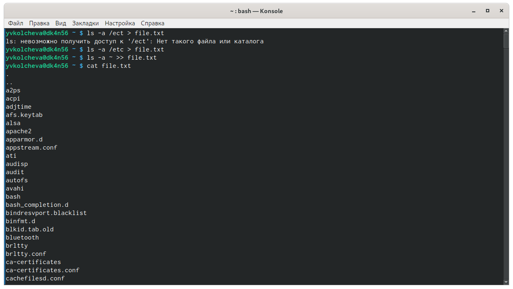
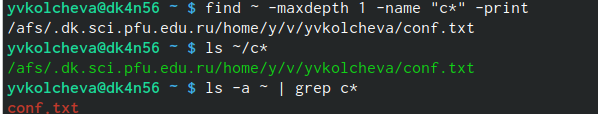
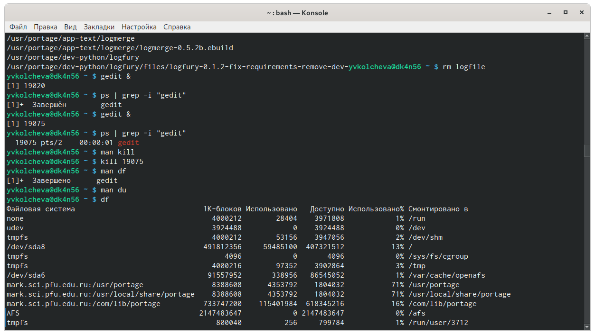
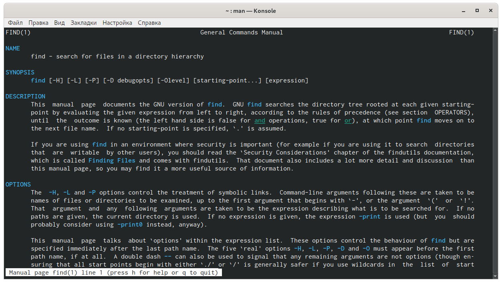
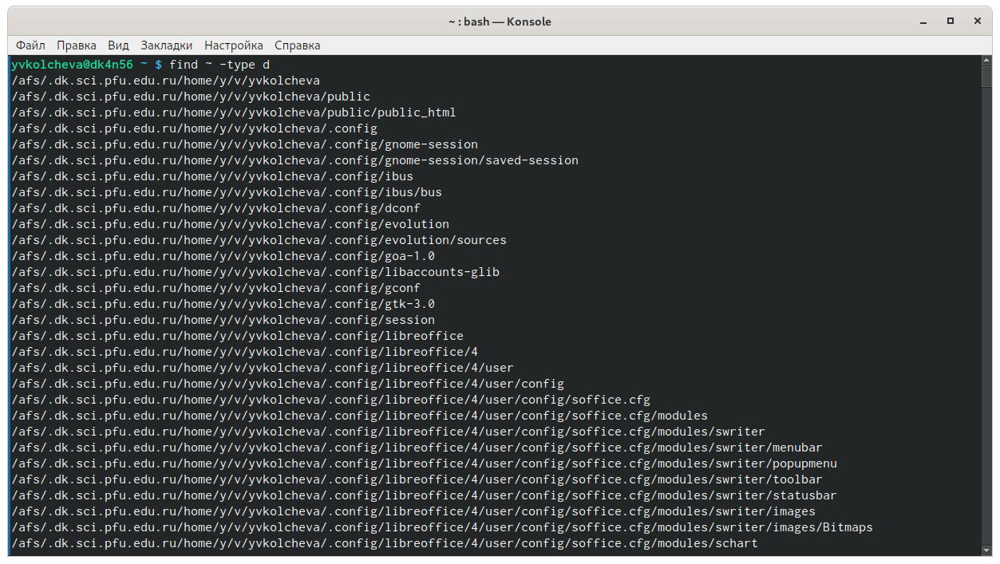

---
## Front matter
lang: ru-RU
title: Операционные системы 
author: Колчева Юлия Вячеславовна
institute: RUDN University, Moscow, Russian Federation

date: 11 мая 2021 год

## Formatting
toc: false
slide_level: 2
theme: metropolis
header-includes: 
 - \metroset{progressbar=frametitle,sectionpage=progressbar,numbering=fraction}
 - '\makeatletter'
 - '\beamer@ignorenonframefalse'
 - '\makeatother'
aspectratio: 43
section-titles: true
---

# Лабораторная работа №7

## Запись файлов
Осуществляю вход в систему, используя свои логин и пароль. Для того, чтобы записать в файл file.txt названия файлов, содержащихся в каталоге /etc, использую команду «ls–a/etc > file.txt». Далее с помощью команды «ls-a~ >> file.txt» дописываю в этот же файл названия файлов, содержащихся в домашнем каталоге.

{ #fig:001 width=70% }

## Имена

Определяем имена в домашнем каталоге, начинающиеся с символа c, несколькими командами: «find~ -maxdepth 1 -name“c*” -print»,«ls~/c*»и«ls–a~ | grepc*» (рис. -@fig:003)

{ #fig:003 width=70% }

## Редактор gedit

Запускаю  редактор gedit в  фоновом  режиме  командой «gedit &». Чтобы определить идентификатор процесса gedit, использую команду «ps| grep-i“gedit”». Из рисунка видно, что наш процесс имеет номер 19075.Узнать  идентификатор  процесса  можно  также, используя команду «pgrep gedit» или «pidof gedit». Прочитав информацию о команде kill с помощью команды «man kill», используюеё  для  завершения  процесса gedit. (рис. -@fig:007)

{ #fig:007 width=70% }

## Команда find

Вывожу имена  всех  директорий, имеющихся в моем домашнем каталоге с помощью команды «find~ -typed», получив информацию с помощью команды «man find» (рис. -@fig:011) (рис. -@fig:012)

{ #fig:011 width=70% }

{ #fig:012 width=70% }

## Выводы
В ходе выполнения данной лабораторной работы я изучила инструментыпоиска файлови фильтрации текстовых данных, а также приобрела практические навыки: по управлению процессами (и заданиями), по проверке использования диска и обслуживанию файловых систем.

## {.standout}

Спасибо за внимание!
