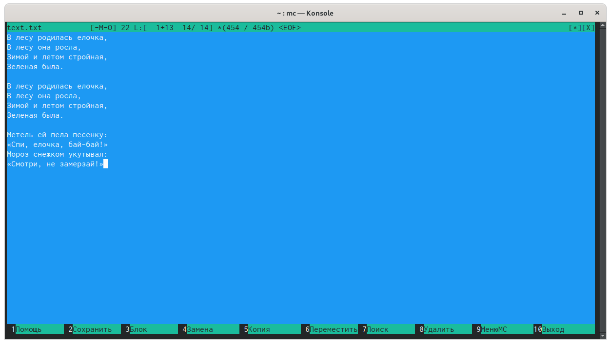

---
## Front matter
lang: ru-RU
title: Операционные системы 
author: Колчева Юлия Вячеславовна
institute: RUDN University, Moscow, Russian Federation

date: 13 мая 2021 год

## Formatting
toc: false
slide_level: 2
theme: metropolis
header-includes: 
 - \metroset{progressbar=frametitle,sectionpage=progressbar,numbering=fraction}
 - '\makeatletter'
 - '\beamer@ignorenonframefalse'
 - '\makeatother'
aspectratio: 43
section-titles: true
---

# Лабораторная работа №8

## Редактор mc
Запустим mc из командной строки.

{ #fig:002 width=70% }

## Работа с текстовым файлом

{ #fig:045 width=70% }

## Выводы

В ходе выполнения данной лабораторной работы я освоила основные возможности командной оболочки Midnight Commander и приобрела навыки практической работы по просмотру каталогов и файлов и манипуляций с ними.

## {.standout}

Спасибо за внимание!
