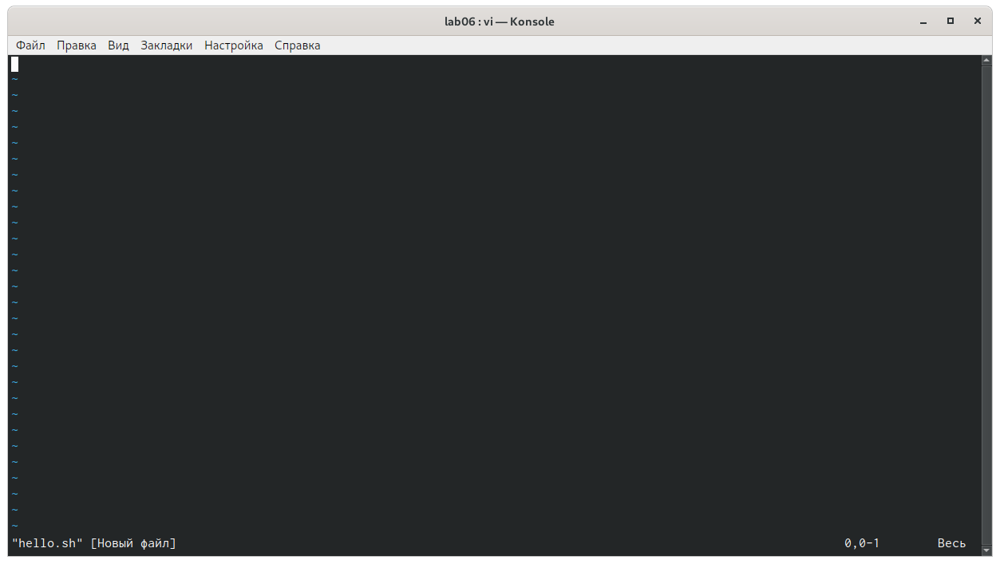
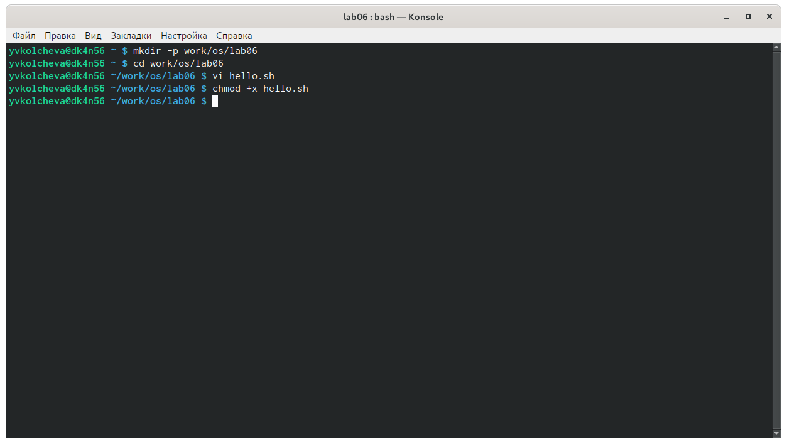
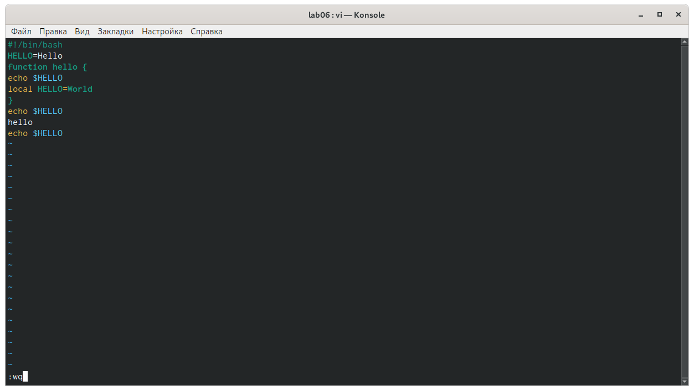

---
## Front matter
lang: ru-RU
title: Операционные системы 
author: Колчева Юлия Вячеславовна
institute: RUDN University, Moscow, Russian Federation

date: 18 мая 2021 год

## Formatting
toc: false
slide_level: 2
theme: metropolis
header-includes: 
 - \metroset{progressbar=frametitle,sectionpage=progressbar,numbering=fraction}
 - '\makeatletter'
 - '\beamer@ignorenonframefalse'
 - '\makeatother'
aspectratio: 43
section-titles: true
---

# Лабораторная работа №9

## Редактор vi
Редактор vi

{ #fig:002 width=70% }

## Консоль

Чтобы сделать файл исполняемым, используем команду «chmod +x hello.sh» (рис. -@fig:006)

{ #fig:006 width=70% }

## Команды

{ #fig:013 width=70% }

## Выводы

В ходе выполнения данной лабораторной работы я познакомилась с операционной системой Linux и получила практические навыки работы с редактором vi.

## {.standout}

Спасибо за внимание!
